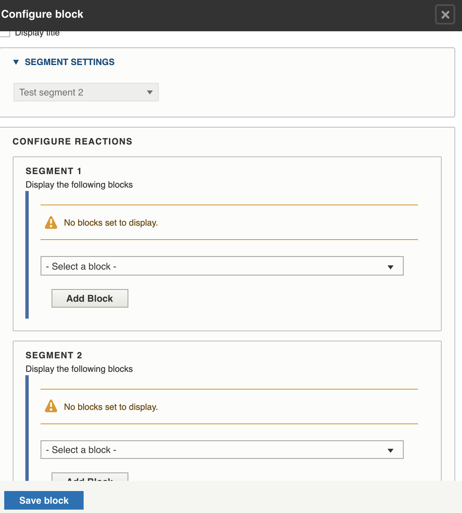

==================
Smart blocks
==================

Smart blocks provide some tools to allow us to display existing blocks based on defined conditions.  To use:

* create the blocks you need to use
* create a Decision block

.. note::  In its initial implementation this is very limited. It only allows us to create segments based on whether the user is on mobile, browser language, operating system.  It supports cookies and localStorage but will require additional build out for ILAO to use these methods.

Creating segments
==================
Segments are managed under `Structure/Smart Content <https://www.illinoislegalaid.org/admin/structure/smart_content_segment_set>`_

Segment sets can include segments that filter on:

* Mobile
* Operating systems
* Language (browser); this may be different than their viewing language on the website.  
* Cookies.  These require ILAO to define and store user cookies in the user's browser
* LocalStorage.  These require ILAO to define and store data in the user's local storage on their browser.

Conditions can be complex.  In the example below, there is a condition of if the user is on mobile and either they have a donor cookie or a return user localStorage value, then the user meets this segment.

.. image:: ../assets/smart-block-segments.png

.. note:: Segment sets should ideally have multiple segments so that when used in a decision block, each segment can be assigned a specific block.  For example, a mobile segment set might have a segment of mobile and a segment for not mobile.  Then in the decision block, mobile might see block A and not-mobile would see block B.

Decision Block
================
To use these segments to deliver appropriate smart blocks, you would place a block of type "Decision block" and 

Decision blocks:
* Can use only one segment set
* Can display only one block per segment

Live helpX

Need help finding legal information or forms?

<a style="background: #0079d0; color: #fff; padding: 16px 32px 16px 32px; margin-right: 20px;">Chat Now</a>

                             