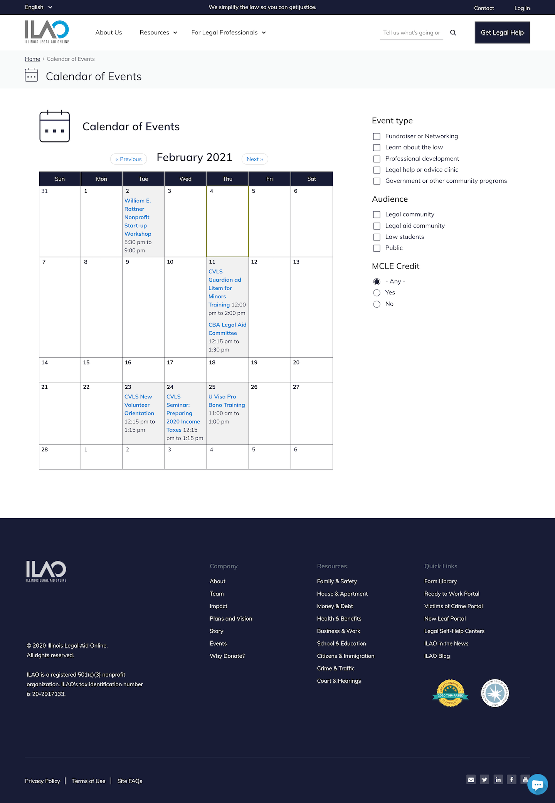
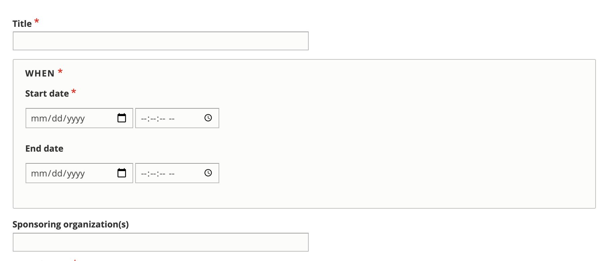
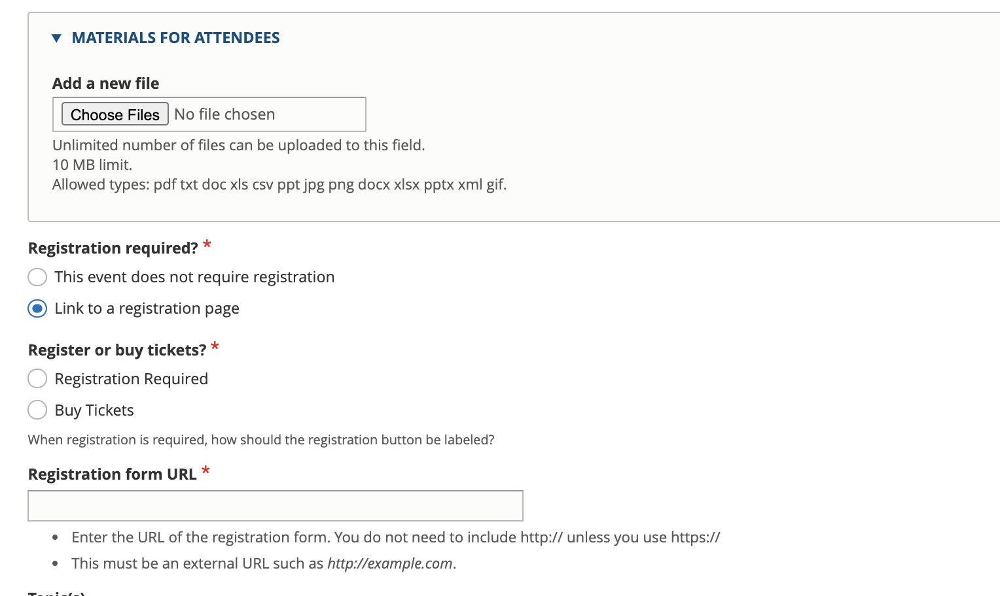

===================
Calendar
===================

The calendar is part of the "For Legal Professionals" menu.  It is only available on the English website.  

Who can post events
====================

Users with these roles can add and edit their own events:

* Legal self-help center navigator
* Pro bono members
* Legal aid members

Intern and staff users can edit ANY event.  

Anyone can view an events.

Adding an event
=====================

To create an event, a user must:

* Add a title (name of the event)
* Add the event's start and ending date/time
* Optionally, add a sponsoring organization.  This is a text field.

.. note:: In earlier versions of the website, events were tied to organizations with inherited permissions and a separate set of fields had to be used for independent events. Starting in 2020, events are associated with individuals and not tied directly to any organization-based permissions.

* Select the event format:

  * In person - this will then add a field for an address
  * Online/Webinar, Telephone - this wil then add a field for instructions
  * Alert/notice - this is usually for something that has no online or in person component.  Examples might be a window for a program, Pro bono week, etc.
  
.. image:: ../assets/cms-calendar-location.png  

* Add a required event description.  This is the general body for the event details.
* Contact email.  This defaults to the logged in user but can be changed.  This is not displayed on the website but  may be used by ILAO if we need to contact someone about the event.
 
* Optionally, add 1 or more speakers.  
* Select an audience.  When legal community is selected, legal aid community and law students are automatically added; law students can then be removed if needed.
* Select one or more event types.

.. image:: ../assets/cms-calendar-speakers.png

* Indicate if the live event is eligible for MCLE credit.  If Yes is selected, additional fields will display: 

  * Total number of MCLE hours
  * MCLE ethics hours (which should be included in the total)
  * A contact email for credit requests
  * An MCLE deadline

.. todo:: review validation for MCLE 

.. image:: ../assets/cms-calendar-mcle.png 

* Optionally, upload 1 or more files that will be attached to the event.  Once uploaded, you can add a description that will replace the file name when shown to the user.  Multiple files can be added, one at a time.

* Indicate if the user is registering or buying a ticket.  This is no longer used on the front end and will be removed in the future.
* Indicate whether registration is required.  If registration is required, add the link to register

 
.. todo:: Register or buy tickets should be removed. 

* **For staff users only** there is an option to select or upload an image.  This is helpful for sharing on social media.

* Select one or more legal issue topic related to the event.  Events can be tagged to top level terms.

.. todo:: Evaluate front-end when lower-level terms selected.

 