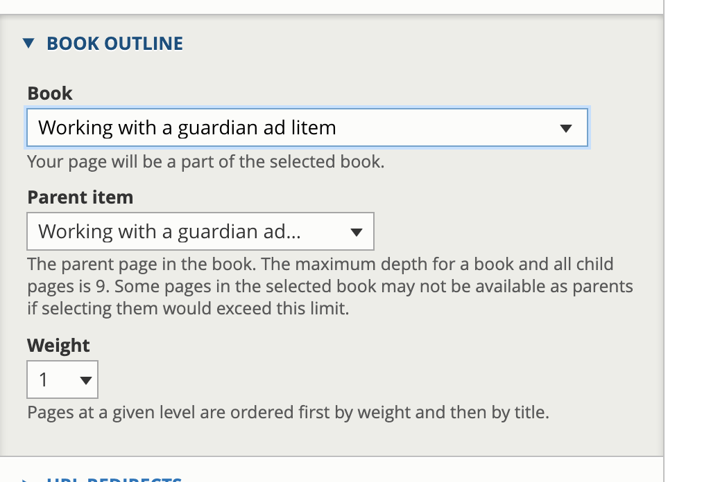

=====================
Lawyer Manuals
=====================

Lawyer Manual (ADRM) content is a content type built off the Drupal Book module.

.. note:: Text articles that are tagged as "Lawyer manuals" in the legal issues taxonomy are not lawyer manuals within the meaning of this section although they may appear in the Lawyer manuals category in practice resources.  They do not have the Lawyer manual format, icon, or label.  On the find legal content report, filtering on Lawyer Manual will only bring back this ADRM (book) content.

Page features
===============

* Individual pages for each "chapter"
* A table of contents for the entire manual or book
* An overview block on child pages that provides a snippet to the first chapter
* Previous and next navigation within each book
* Are tagged with the Lawyer Manuals content format with accompanying icons and labels.

.. image:: ../assets/cms-adrm-public.png

Finding Lawyer Manuals
========================

* each chapter is listed individually on the practice resources pages (law practice and the Individual substantive areas)
* the first chapter is listed on the legal information pages (category and subcategory pages targeted to the general public)

Adding or editing ADRM content
================================

Editing Lawyer Manual content is similar to editing legal content with some key differences:

* It defaults to Advanced automatically
* It has fewer options for paragraphs (text, file, link, and video)
* It does not have translation-related fields as we do not translate attorney resources
* It needs to be in a book

A page of Lawyer Manual content is assigned to a book 

* If it is the first page in a new book, then select Create a new book
* Otherwise, select a book
* It needs to be assigned a parent.  Books can go down multiple levels, but it is recommended that we limit it to 1 child and each page be tagged to the first page of the book.

All lawyer manuals can be reordered using drag and drop from the `Book admin page <https://www.illinoislegalaid.org/admin/structure/book>`_.

