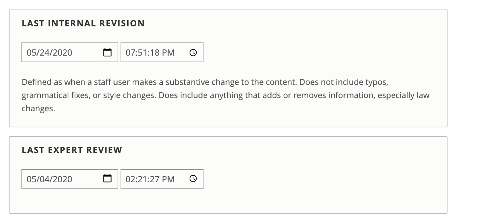

===================
Legal content type
===================

The legal content type is the content type for the bulk of our legal information.

.. toctree::
   :maxdepth: 1
   :caption: Contents:

   cms_legal_content_by_type
   cms_legal_content_annual_updates
   cms_legal_content_workflows
   cms_legal_content_scheduling
   cms_legal_content_taxonomies

Related content
=================
Related content, labeled "Learn More" is pulled from one of two places, depending on the legal content:

* For legal content that is included in a Guide, the learn more is pulled from the parent Guide's learn more field
* For legal content that is not included in a Guide, the learn more is pulled from the Recommendations field.  Content managers can add or edit the Recommendations field.

(Related) Forms
=================
A forms block (previously related forms) is added to legal information pages based on the taxonomy term(s) associated with the legal content. 

.. note:: We are considering another option to make it so that the forms block can be manually created rather than pulled by taxonomy term.

Content Restrictions
======================

Content may be restricted:

* IICLE content is always restricted REGARDLESS of any manual settings.
* Other types of legal content may be restricted to legal aid members, pro bono members, or both by using the Restrict to field

.. image:: ../assets/cms-legal-content-restrict.png

When these are checked:

* Staff or legal aid members may access content restricted to legal aid members
* Staff or pro bono members may access content restricted to pro bono members
* Staff, legal aid members, and pro bono members may view restricted content when both checkboxes are checked.

.. note::  When content is restricted by role, it can also only be edited by users with that role.  A legal aid member editor can not edit content that is restricted to only pro bono members for example.

Dates on Content
==================

There are four dates that impact content:

* Created date.  This is the date the content was created.  This can (but shouldn't be except in exceptional circumstances in the authoring section on the content edit form)
* Last updated date.  This is a system-generated date created every time a node is changed in anyway.
* Last revised.  

  * This is set manually by staff.
  * Defaults to the current date/time on new content but is not changed on future edits unless it is manually changed.
  * This appears on legal content as the Last revised date.
  
* Last reviewed. This is set manually by staff. This appears on legal content as the Last reviewed date.

.. note::  The last revised and last reviewed dates are not translatable.  The dates apply to all translations of a piece of legal content.

See also:

* `Content Team Documentation <https://sites.google.com/illinoislegalaid.org/contentnet/content-team-documentation>`_

