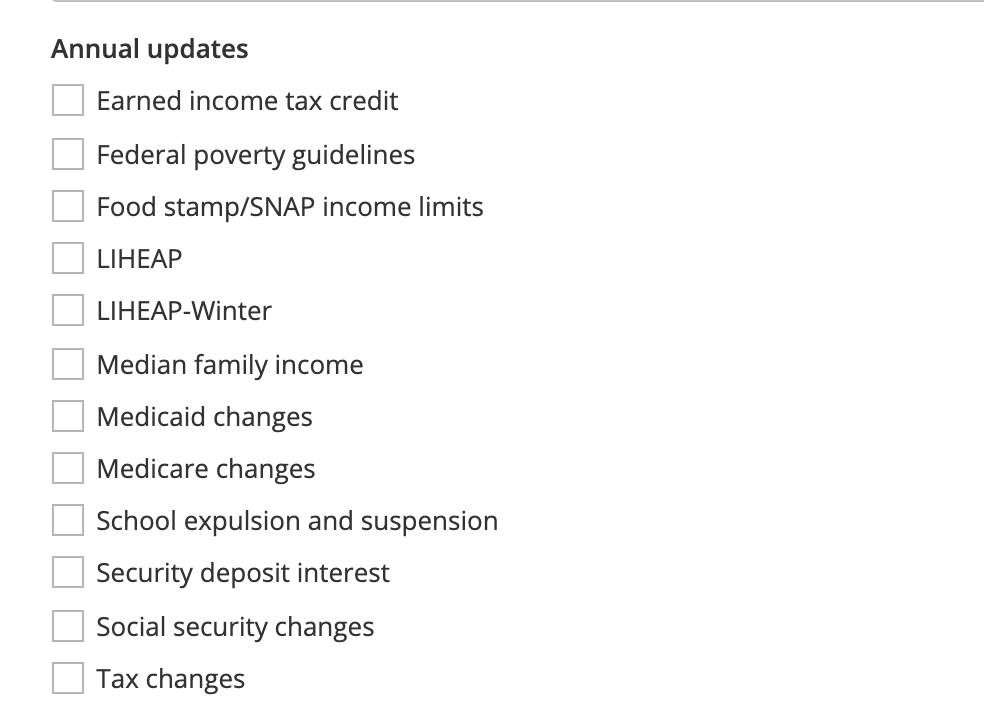

.. _annual-updates-label:

===================
Annual Updates
===================

Legal content can be tagged with an annual update when it needs to be reviewed on an annual basis because it routinely becomes out of date.  The annual update list is pulled from the `annual update taxonomy <https://www.illinoislegalaid.org/admin/structure/taxonomy/manage/annual_updates/overview>`_.

Adding an annual update term
=============================

Adding an annual update term requires adding a term to the annual updates taxonomy and giving it a recurring date pattern.  For example, food stamps changes tend to happen in October so a recurring date of Oct 1 may be appropriate.

Notifications
===============
The system automatically sends an email to users with the content manager role 30 days ahead of the recurring date with a list of all the content tied to that annual update.  It will not send again until the next occurrence.
