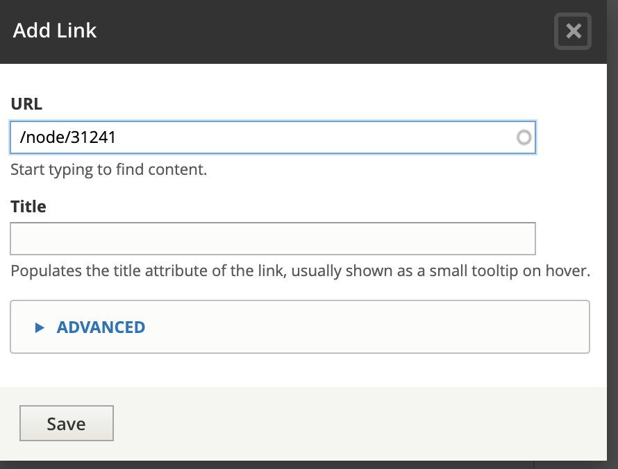

===============================
Link tool in WYSIWYG
===============================

The link button in the WYSIWYG uses a module that allows users to create a link OR to insert an internal link.

To add a standard link:

* To add a hyperlink to an external webpage, just type or paste in the full url.  For example:

  * https://www.google.com
  * www.google.com

* To add an email link, enter mailto:emailaddress in the url field.  For example, mailto:info@illinoislegalaid.org
* To add a hyperlink to an internal link, type the English title into the text box.  A list of content will appear.

.. image:: ../assets/content-link-node.png

* For Spanish and Polish pages, add the /es/ or /pl in front of the node.  For example, in the image below, the url is /node/31241.  For Spanish, it would need to be updated to /es/node/31241 and for Polish /pl/node/31241.

To use anchor tags:

* For the anchor, create a link that leaves the url empty but adds a unique ID to the page.

.. image::  ../assets/content-link-full.png

* For the anchor link, create a hyperlink that links to #[id].  For example, if you create an anchor named item1, the hyperlink to it would be #item1.  

