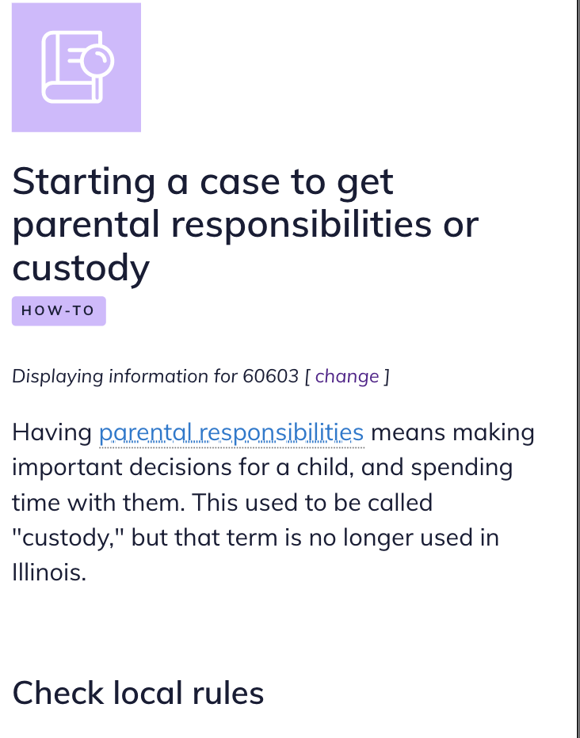
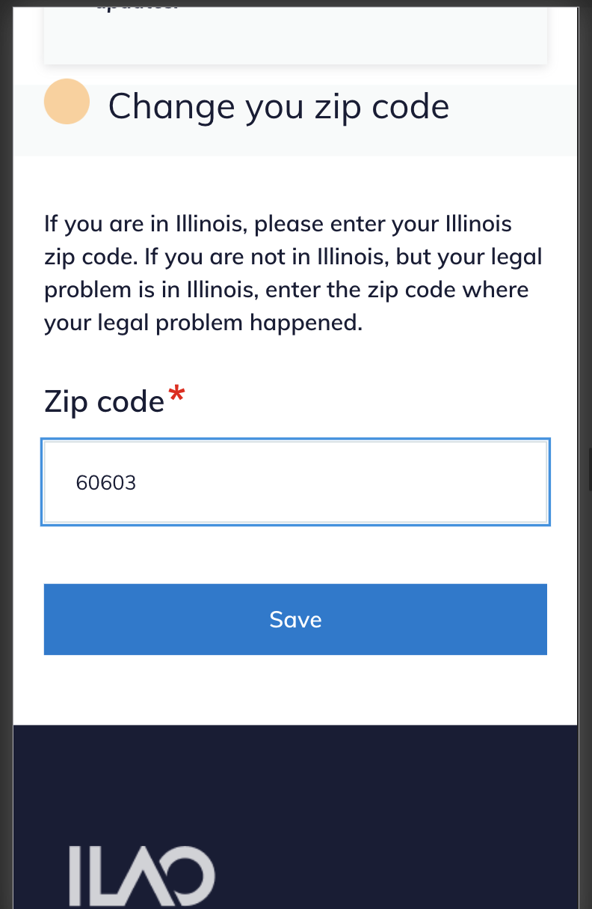

========================
Local content tool
========================

The local content tool appears as a wand on the WYSIWYG tool next to the spell check button.  The tool is used to insert region specific content and supports limiting the markup to the county, city, or zip code level.  Front-end code then causes the text to display only to users whose location matches the inserted code; it is hidden for all other users.

.. image:: ../assets/cms-local-content-button.png

.. note:: The tool does not support editing of existing markup.  To edit, a content editor must edit within the inserted span tags.

.. image:: ../assets/cms-local-content-wizard.png

To use
========

To use the tool to insert text: 

* Select the region type
* Use the autocomplete to insert a county, city or zip code
* Type in the text you want to include.

This will insert code like: {span|county|Madison|This is content specific to Madison county.} formatted as:

* span
* region type
* region name
* content

.. image:: ../assets/cms-local-inserted.png

The content can then be formatted or edited within the WYSIWYG window.

Example use case
==================

Legal content contains the following:

Generally, x is true. {span|county|Cook|In Cook County, the law is different and x is true only on Mondays.} {span|county|Kane|In Kane County, the law is different and x is true only on Tuesdays.} {span|city|Aurora|Even within Kane County, Aurora has its own rule and x is also true on Mondays as well.} {span|Zipcode|60505|And if you are on the near east side of Aurora, x is also true on Wednesdays.}

**A user in Lake county, where there is no localized content, would see:**

Generally, x is true.

**A user in Cook county, where there is county-specific content, would see:**

Generally, x is true. In Cook County, the law is different and x is true only on Mondays.

**A user in Elgin (Kane County), would see the Kane county specific content:**

Generally, x is true. In Kane County, the law is different and x is true only on Tuesdays.

**A user on the west side of Aurora with a zip code of 60506 would see both the Kane and Aurora content:**

Generally, x is true. In Kane County, the law is different and x is true only on Tuesdays. Even within Kane County, Aurora has its own rule and x is also true on Mondays as well.

**And a user on the east side of Aurora with a zip code of 60505 would see the local county, city, and zip code content:**

Generally, x is true. In Kane County, the law is different and x is true only on Tuesdays. Even within Kane County, Aurora has its own rule and x is also true on Mondays as well. And if you are on the near east side of Aurora, x is also true on Wednesdays.

What users see
==================

On legal content pages, the zip code is automatically prepopulated:

* for "new" anonymous users, using ipInfo database to detect their zip code. 
* for "returning" anonymous users, the detected zip code is stored locally for a week
* for logged in users, the zip code is pulled from their profile

On legal content pages, users see text Displaying information for zipcode [change].  

Users can click on the change link to go to a page to change their zip code:

When the user changes their zip code, they are returned to the legal content they were viewing.

 

