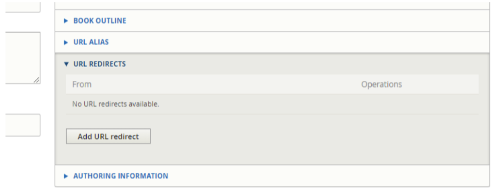
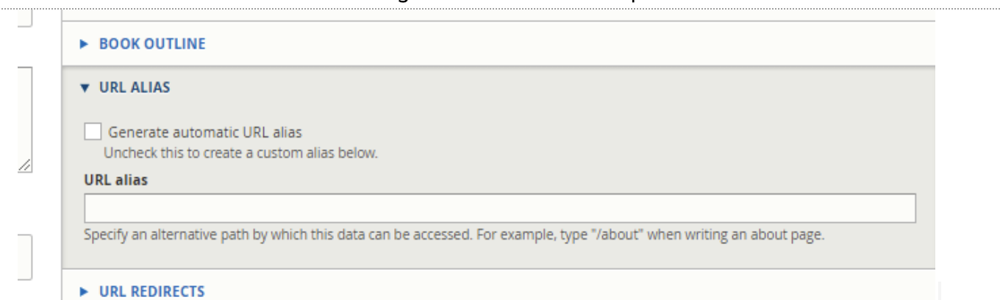

=================================
Creating redirects between pages
=================================

If you need to redirect one page to another page (for example, "Old article" to "New article") so that users who access the old url are automatically moved to the new url.

.. note:: You will need to do this for each language that the old article is available in as the path alias is different per language.

**Step 1**: Grab the url you need to redirect from (for example, for an English legal content, legal-information/old-article)

**Step 2**: Go to the edit form of the new page that you are redirecting TO

**Step 3**: Click the Add URL redirect in the right pane

**Step 4**:  Fill out the add URL redirect form

* Enter the path you are redirecting from.  This is the legal-information/old-article for example
* The To is likely already pre-populated but you likely have to edit it to trigger the autocomplete or you will get a path error on saving.
* Set the redirect status.  This should always be 301 Moved Permanently unless the redirect is temporary (for example, redirecting users temporarily from our donate page to a special event donate page for a time-limited appeal)
* Save

.. warning:: If you get an error that the redirect will create a loop or is circular STOP and reach out to Gwen for help.  There's likely an existing redirect that needs to be fixed first.

**Step 5**:  Clean up the old path alias

There is a conflict between path aliases and redirect where the path alias will override the redirect.  You need to:

* Go to the old article
* Navigate to the URL alias pane
* Uncheck "Generate automatic URL alias"
* Remove the text in the URL alias
* Save the content (for legal content, you will need to add a revision log)

**Step 6**:  Redirect the actual node.  

* Repeat the same steps as Step 3 and 4 only this time, the path should be node/[node-id]

.. warning::  This step must be done after the path alias is removed or you will likely get an infinite loop message and/or service unavailable message

.. image:: ../assets/cms-redirect-node-id.png

**Step 7**:  Verify that the redirect works.  If it doesn't, wait 15 minutes for cache to clear and check again.  If it still isn't working, reach out to Gwen.

