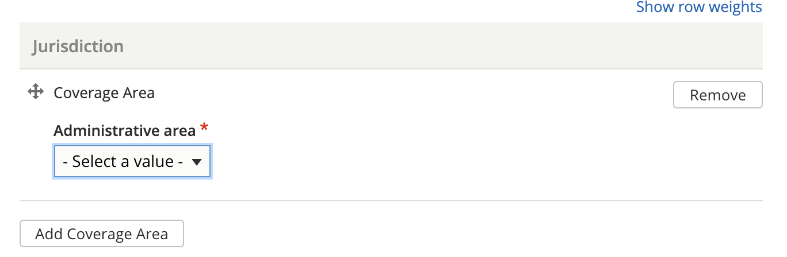
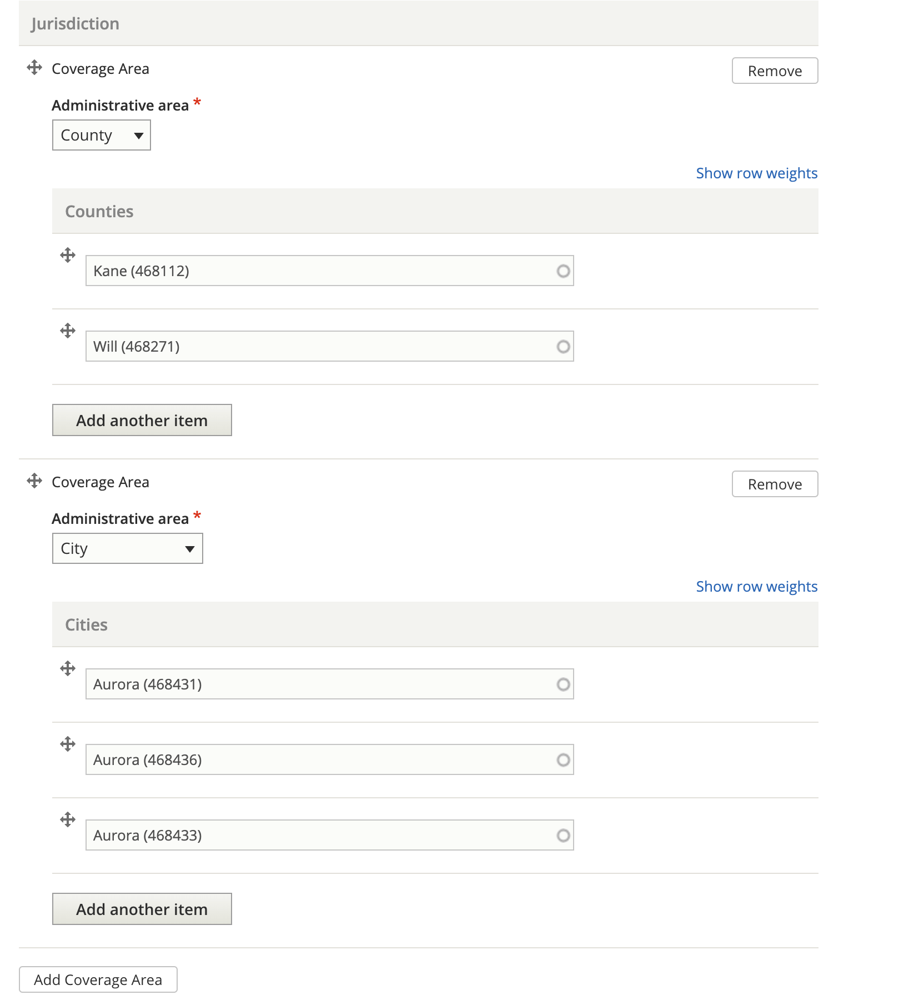

.. _cms-coverage-area:

===================
Coverage area
===================
Coverage area, or jurisdiction can be set for various elements of structured content (for example, a how-to may have a coverage area that is different from the coverage area for a legal form).

Coverage area can be set at different levels:

* Country (defaults to United States)
* State (defaults to Illinois)
* County
* City
* Zip code

A coverage area can have more than one entry in a specific administrative area (for example, multiple counties).

Multiple coverage areas can be set to allow content to be tagged across different administrative areas (for example, by tagging the county of Kane and the city of Aurora, which crosses county lines).

