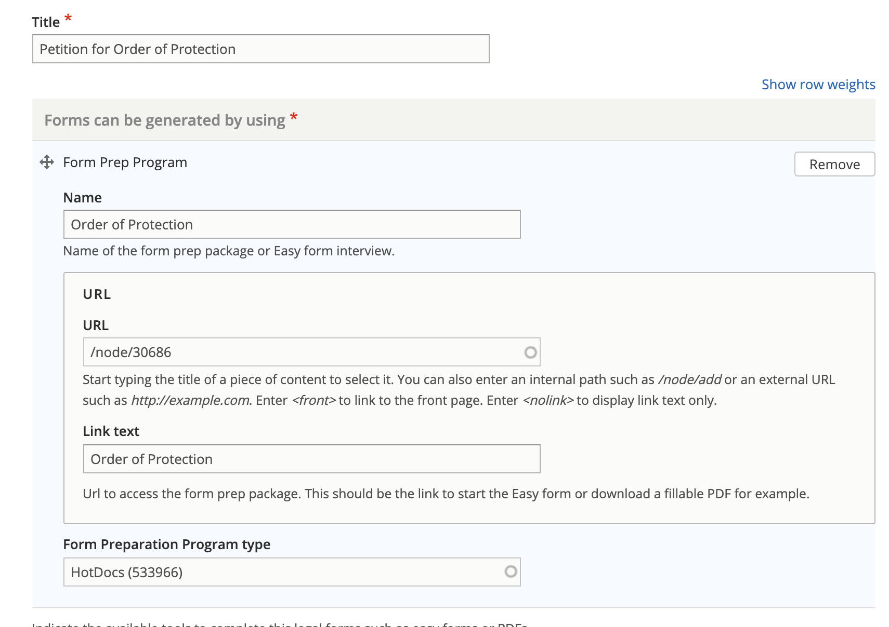

=======================
Legal forms
=======================

Legal forms can be part of a legal solution. Legal forms should be the **specific** form, not to a form generator packet. 

Relationship to Easy Forms
============================

Easy forms are our guided interviews that generate one or more court forms.  An Easy form may be referenced as the form prep program that generates the specific legal form.  

For example, our Order of Protection Easy Form generates:

* Petition for Order of Protection
* Emergency Order of Protection
* Order of Protection
* Summons (Protective Orders)
* Additional Incidents of Abuse
* Additional Case Information
* Confidential Name & Location of the School or Daycare
* Affidavit of Parenting Time Supervisor

Each of these would be created as Legal forms and would link to the Easy form.

Relationship to Statewide fillable PDFs
==========================================

Like Easy forms, PDF is a type of form prep program that can be added to a legal form.

Creating and editing a legal form
====================================
A legal form should have:

* A title (the name of the form)
* A content and meta description
* A form can be generated by using section with 1 or more generators:

  * The name of the Easy form or PDF that can be used to complete the form
  * The url to the form
  * The link text (this is optional)
  * The form preparation program type.  This is an `ILAO taxonomy <https://www.illinoislegalaid.org/admin/structure/taxonomy_manager/voc/form_prep_programs>`_ that includes:
  
    * A2J interview
    * Docassemble
    * HotDocs
    * PDF
    
* Optionally, indicate the form use.  This is particularly helpful when the form is part of a larger package and is only sometimes generated.  For example:  This form is required when there are minor children in a divorce-related case.
* Indicate the jurisdiction for the legal form.  

.. note:: Both legal forms and legal solutions have jurisdiction tags.  It is possible for a solution to be statewide and have legal forms that apply only to a specific jurisdiction.  It is not necessary to create individual solutions for jurisdictions unless the solution content itself varies by zip code, city, county, or state.      
    

Full add/edit form
======================
..  image:: ../assets/cms-structured-legal-forms-edit.png