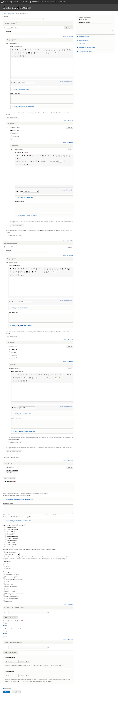

.. _cms-legal-question:

======================
Legal Question
======================

Legal questions can potentially "stand alone" or be part of a larger FAQ within a specific  :ref:`cms-legal-problem`.

To create a Legal Question:

* Add the Question title
* Add the Answer as the Accepted Answer.  An accepted answer uses the :ref:`cms-structured-text` block.  

.. note::  Answers should be broken into segments, either paired markup or list items to avoid having to deliver large blocks of text over non-web interfaces.  Web interfaces can concatenate segments back together.

* Optionally add one or more suggested answers.  
* Add a jurisdiction for the question. See :ref:`cms-coverage-area` documentation.

.. note:: By adding jurisdictions to questions, we can offer location-specific answers.  For example, in answering "Can I deduct a repair cost?," the answer may be different in Chicago than in Naperville.  When included in an Illinois problem of "My landlord won't fix my bathroom," we can deliver the right Legal Questions to the right users.

* Add a content description.  This is the description that will be used if the question is displayed independently on our website.
* Add a meta description.  This is the description that will be used in social media, search indexes, and in any API.  This should be limited to 300 characters.
* Optionally, add a disambiguation description.  This is used to better describe how one problem is different from a related problem. 
* Tag the legal question to one or more legal issues. 
* Select the primary legal category
* Add the legal position associated with the problem. 
* Tag the legal question to annual updates.
* Optionally, add an author/SME to the question
* Indicate whether a translation should be requested. 
* Indicate whether an existing transation should be marked as outdated.
* Optionally, add any content management tags
* Set the last reviewed and last revised date per content policy.

Full add/edit form
====================

