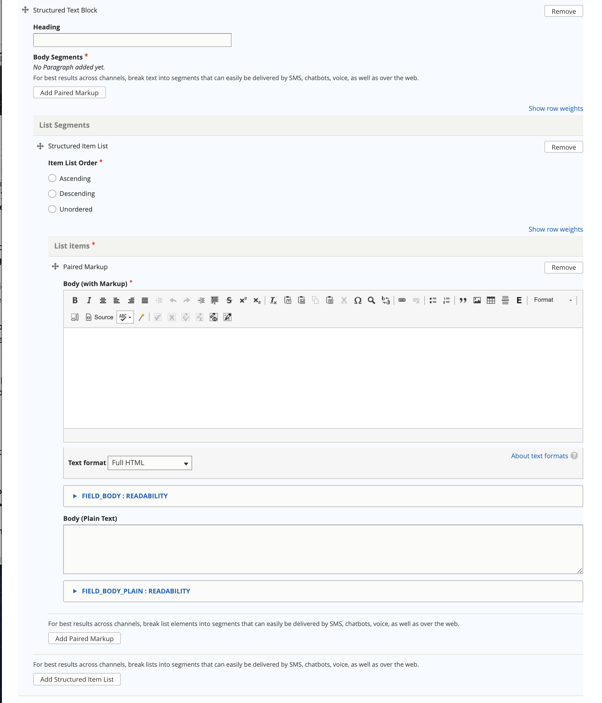

.. _cms-structured-text:

============================
Structured Text & Lists
============================

The structured text and lists component is designed to support either paired markup or structured lists that exist in otherwise unstructured text.

.. note:: For lists such as steps in a How-to and questions in a FAQ, structure is automatically enforced.  But in freestanding text like eligibility rules or answers to questions, we need more structure around lists when those are appropriate to use.

The component is used in:

* Legal solution (for eligibility rules and result)
* Legal question (for answers and suggested answers)

Paired markup and/or list segments in structured text & lists should be sufficiently discrete to work well when delivered over SMS and similar.  It is perfectly okay to use multiple paired markup segments to answer a question or explain an eligibility rule or result.

A Structured text block:

* May have a heading
* Must have a body segment.  The body segment must have at least one of:

  * a :ref:`cms-paired-markup` section
  * a List segments section
  
.. note:: You must remove the segment that you are not using in order for the form to validate.

Paired markup section
=======================

Please see the :ref:`cms-paired-markup` documentation on how to use paired markup.

List segments section
=======================  

The list segment section consists of:

* a item list order.  This indicates whether a list should be:
  
  * in ascending order (items are rendered in the order they exist and numbered 1, 2, 3)
  * in descending order (items are rendered in the order they exist and items are numbered 3, 2, 1)
  * unordered (items are rendered in the order they exist but with no numbering)

* one or more list items.  Each list item is a paired markup segment.

