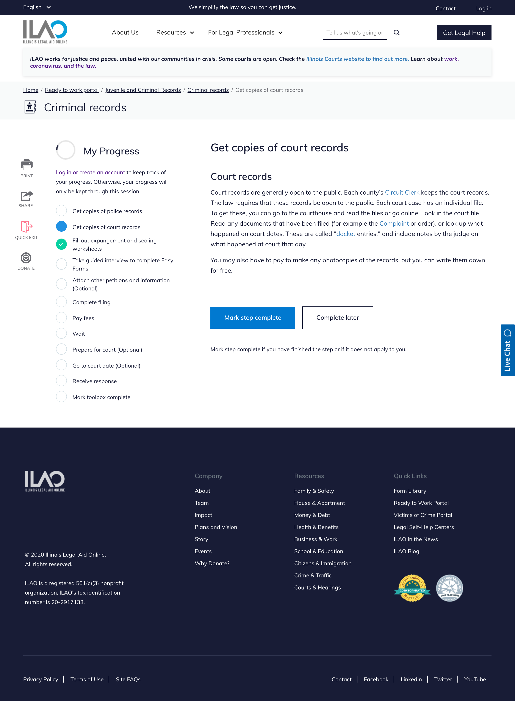
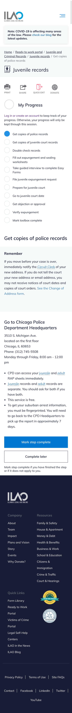

=========================
Tool step content type
=========================

Creating a tool step
=======================

To create a tool step:

* Add a title
* Pick the tool the step goes into
* Indicate whether the step is always required.  
* Indicate if this is the last step in the process.  A tool should have exactly 1 last step.
* Add a step type.  This adds the content to the page.  
* Optionally add toolbox step components of type callout

**After adding a step, you must go back to the associated tool and add the tool step to the tool step list and order the steps correctly**

.. note::  The last step in the tool must be marked as the last step.  There should only ever be one and it should be at the end of the toolbox.  The last step will then give the user the option to mark the toolbox complete.  This is usually going to be a "Mark toolbox complete" step.

Step types
------------
There are 4 supported step types in tool steps:

* Process step
* Webform
* Fill out forms (single)
* Fill out forms (multiple)

Process step
^^^^^^^^^^^^^
Similar to the process step in How-to's, this is the primary way to include text in the tool step.  A process step includes:

* A title
* A body

These will not be numbered in the tool steps.

Webform step 
^^^^^^^^^^^^^^

The webform step type includes:

* an optional heading
* an optional body
* a webform.  The webform must already exist.  

Fill out forms (single)
^^^^^^^^^^^^^^^^^^^^^^^^
This should be used when adding one internal form (either an Easy Form or blank form linked to or downloadable from our website).  If you need to provide multiple forms on the page, use the Fill out forms (multiple) option OR a process step.  

For this component you need to:

* Add a form (easy form or blank form)
* Indicate whether it is required or not (this is a required field but does not display to users at this time)

The appropriate template (easy form, link form, or form download) will render automatically.

.. note:: While the internal forms paragraphs bundle has a callout option, it does not render.

Fill out forms (multiple)
^^^^^^^^^^^^^^^^^^^^^^^^^^
DO NOT USE.  This is currently buggy and needs to be fixed as it doesn't display more than one form in each section.

For multiple forms, it is best to use the process step for now.

Tool Step Components
-----------------------
Callout is the only tool step component supported.

A callout is an optional component that can be used below the main text of the page to highlight important information.  Tool steps should have no more than 1 callout and can be positioned above or below the text on process steps.

Callouts display with a slightly shaded background.

What users see
===================

Tool with a process step
--------------------------

Desktop:

Mobile:

Tool with a webform
---------------------

.. image:: ../assets/tool_step_webform.png

Tool with a single form
-------------------------

.. image:: ../assets/tool_step_easyform.png

Tool with multiple forms
--------------------------
Currently does not work

Last Step
-----------------

When a user sees a step that is marked as the last step:

* the content of the step displays
* if the user has incomplete steps:
  
  * those are listed as a reminder in a callout
  * the primary button on the page is "Save toolbox progress"
  * the secondary button is "Mark toolbox complete"
  
* if the user has no incomplete steps:

  * the primary button on the page is "Mark toolbox complete"
  * the secondary button is "Save toolbox progress"
  
Desktop:

.. image:: ../assets/toolbox-incomplete.png

Mobile:
   
.. image:: ../assets/tool-incomplete-mobile.png
   :scale: 50%
   

When the tool is marked complete
-----------------------------------

When the user completes the tool and marks the toolbox complete:

* they are given a well done message
* they have the option to view their toolboxes.  This returns them to the toolbox selector results page with the completed tools marked done and incomplete tools ready to be started.
* they have the option to provide feedback via SurveyMonkey

Desktop:

.. image:: ../assets/toolbox-confirm.png

Mobile:

.. image:: ../assets/tool-mobile-welldone.png
   :scale: 50%

The well done image and text are managed in the `Final toolbox page image block. <https://www.illinoislegalaid.org/block/236>`_

My Progress block
======================
The "My Progress" block tracks a user's progress across the tool.  

* For logged in users, it will remember their progress over the course of 1 year.
* For anonymous users, it will remember their progress only for the current session.

.. note::  This is a change from the Drupal 7 site where the 'return code' allowed users to return.

As a user progresses through a tool:

* The current step, if it has not been previously marked complete, will be blue and filled
* Incomplete steps will be white with a blue border
* Steps that are marked complete will be green with a check in them

