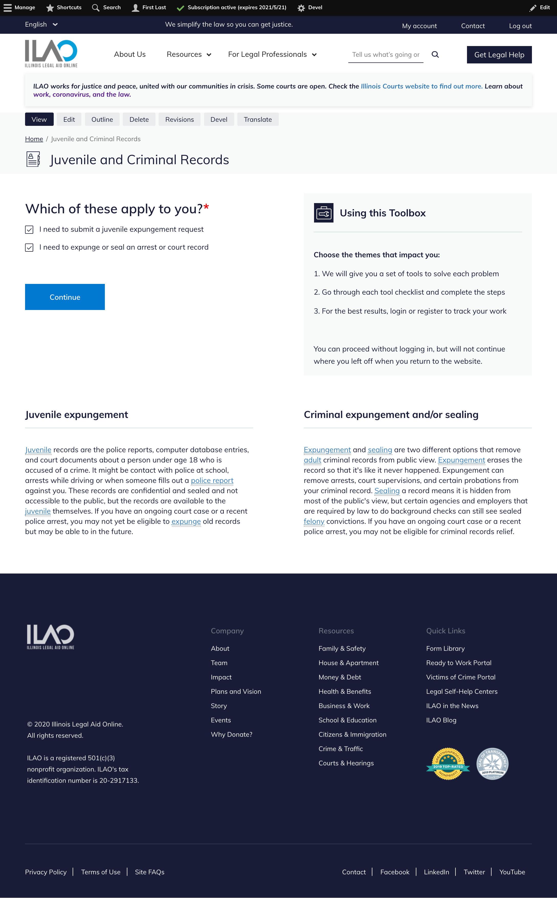

================================
Creating and managing toolboxes
================================

Creating a toolbox
=====================

* Add a title
* Add a content description; this is the description that will be used in content pages and search results.
* Add a meta description; this is the description that will be used in search engines like Google and social media
* Selector form label.  This is what appears in a toolbox selector form on portal content
* Page components: add a split column layout to add summaries of each tool in the toolbox or other information.  The split column layout requires two items, each with a title and body.  

Do not use:

* Page components other than split column layout.

What users see
=================

* There is a form automatically created for all of the tools in the toolbox.  
* The `Using this toolbox <https://www.illinoislegalaid.org/block/231>`_ is static and shared across all toolboxes.
* Buttons in split column layouts do not display to users.

