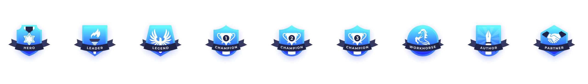

==============
Badges
==============

ILAO awards badges to users based on activity.

There are 6 badges icons for each legal category:

* Hero
* Leader
* Legend
* Workhorse
* Author
* Partner

There are also 3 "Champion" badges per category (1st, 2nd, 3rd).
There is also a star image for milestone awards.

Badges vs Milestones
======================
Badges are awarded based on point counts and can be earned quarterly, annually, or one time.  Examples of badges are:

* Family & Safety Hero
* Crime & Traffic Hero
* Workhorse
* Family & Safety Workhorse

The author and partner badges are reserved for specialty awards rather than general editorial work.  The author badge might be awarded:

* with a label of "Contributor" the first time a user drafts an article from scratch and can only be earned once.
* with a label of "Scribe" the first time a user drafts 5 articles from scratch and can only be earned once.
* with a label of "Wordsmith" for every 10 articles a user drafts and can be earned as often as necessary.

The partner badge might be awarded:
* with a category of "UX Tester" the first time a user completes an observeration test
* with a category of "QA Partner" when a user tests an Easy Form

.. todo:: Do the badges on the dashboard need labels?  Archita didn't include them in the design but I'm questioning that.

Milestones are awarded once. These do not have an icon and appear only on the Milestones block.  Examples of milestones might be:

* 1st article edited
* 100 articles edited
* 250 articles edited
* 5,000 words edited
* 10,000 words edited

Champion badges
=================
At the end of each quarter, champion badges will be awarded to the user with the highest number of points in each category, 1st, 2nd, and 3rd place. These badges would be named for the period awarded: School & Education, Q2 2021.

There is also a global champion badge, awarded based on the total number of points during the quarter.

At the end of the calendar year, annual champion badges are also awarded.

Defining Badges & Milestones
===============================
The badges can be configured in the CMS. Badges and Milestones:

* Have a name.  This is what appears beneath the name.  Examples:  Family & Safety Scribe, House & Apartment Hero, User Testing Expert.
* Description is optional but can be used to define the badge in a user-friendly way.  For example:  Earn the Family & Safety Hero award by earning 200 points editing content in family & safety.
* Image.  Select the badge to use.  **For milestones, leave blank**.
* the maximum number of times a badge can be earned:

  * no limit means as soon as the user hits the number of points required, they earn the badge.  For example, the hero badge could be set to be awarded when a user has earned 100 points in Family & Safety.  If a user earns 300 points in Quarter 2, they would earn the badge 3 times.
  * once means the user can only earn the badge one time ever.  For example, if the Partner badge is set at 10,000 points for Family & Safety, and a user hits 10,005 points on January 4, 2022 and 20,001 points on June 6, 2022, they would only see one Family & Safety Partner badge.
  * once per quarter means the user can earn the badge once a quarter maximum.  For example, if the Workhorse badge is set at 500 points for Family & Safety, and a user hits 501 points on January 4, 2022, 1007 points on February 3, 2022 and then earns 505 points on April 1, 2022, the user would earn the workhouse on January 4 and April 1.  No additional workhorse badge would be earned on February 3.
  * once per year means the user can earn the badge once a year maximum.  For example, if the Leader badge is set at 500 points for Family & Safety, and a user hits 501 points on January 4, 2022, 1007 points on February 3, 2022 and then earns 505 points on April 1, 2023, the user would earn the workhouse on January 4, 2022 and April 1, 2023.  No additional workhorse badge would be earned on February 3.
  
* Which content categories count towards the badge.  A badge could be limited points earned from tasks associated with family & safety content or not limited for example.  The category used is either:
 
  * the primary legal category associated with a node
  * the primary legal category indicated when awarding manual credit.
  
* the point entities that should be counted for a badge award.  For example, the Family & Safety hero badge may be limited to point entities related to content editing while the House & Apartment UX partner may be limited to point entities related to user testing.
* the requirements to earn a badge:
  
  * a number of points/words/articles.  Points should be used unless the badge is a milestone.
  
* a checkbox to indicate that the badge is a milestone award.  
  
.. todo:: Milestones and/or badges may need a date available range.
  
  
  

