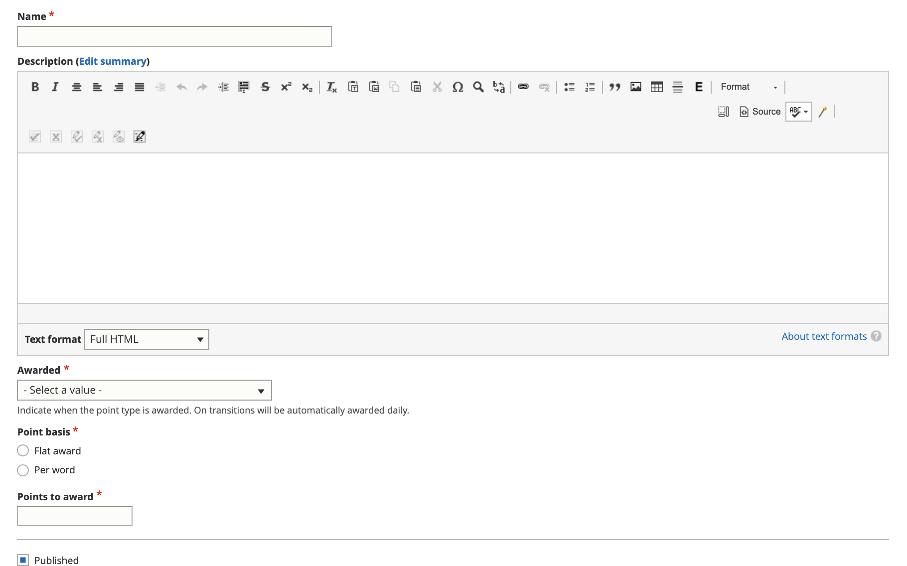

===============================
Points System
===============================

.. note:: this is in development

Point Types
==============

Users with the Staff role may create point types and view a list of all point types.

* Automatic points are awarded when a piece of legal content or ADRM content transitions across workflows:

  * On transition from published to draft - this may be triggered when a user starts an assignment
  * On transition from ready to review to published - this may be triggered when a staff member finalizes submitted work
  * On transition from draft to published - this may be triggered when a staff member creates a draft, inputs SME changes, and then publishes the revision
  * On transition from published to ready to review - this may be triggered when a user turns in completed work and never saved it as a draft
  * On transition from draft to ready to review - this may be triggered when a user turns in completed work and saves as a draft
  
* Manual points are awarded by someone with the staff role. 

Points may be configured to be awarded at a flat rate or based on the number of words in the node. 

Creating a point type
-----------------------
Point types are created as content, although they do not have their own defined visible interface.

Each point type:

* has a title, or name.  Examples might be "User tested a feature" or "Edited legal information for the public"
* has an optional description.  This may be helpful to keep track of why a points type exists.
* has a required Awarded field.  This is used to help track when the points would be awarded by the system.  Points can be awarded:

  * Manually; when this is selected, the system won't ever award the points to a user automatically.  This is useful for awards for activities outside of the legal content CMS.
  * Automatically; based on a transition in the workflow states (for example, when an article is approved by staff and moved from "ready to review" to "published")
  
* has a required Point basis.  Points may be awarded at a flat rate (such as 50 points for taking a user survey) or per word (such as 2 points per word edited in an article)
* has a Points to award field.  This is where the number of points goes.  

.. todo:: Block point types from being indexed by robots.txt.

.. note:: A warning will appear when saving a point type to remind staff to check to see if any existing badges or milestones need to be updated.  For example, when a new point type is added, badges that aren't set to include all point types may need to be updated.  

Rules for Automated Point Awards
==================================

Automated point awards will be awarded:

* To revision authors who do not have the staff or intern role
* Only to the same node/language/author pair once every 24 hours (so that we don't accidentally award points multiple times)

Rules for Manual points 
=================================

Manual points may be awarded via a separate form and may optionally be tied to a legal content node.  This may be most helpful for content editorial contributions that are outside of workflow management such as:

* Easy form reviews
* Toolboxes, tools, and tool steps
* Portal main pages

Point Tracking
=================

Point awards should be recorded on the website with the following information:

* The timestamp of when the record was created
* The timestamp of when the record was last updated
* A reference to the point type awarded
* The user ID of the person earning the point

  * for automated points, it is always the revision author
  * for manual points, it is the user added to the user field on the form
  
* The entity id of the node associated with the points, if one exists 

  * for automated awards, it is the node of the content being revised
  * for manual awards, it comes from the manual credit form  

* The revision id of the revision being tracked, for automated awards 
* The language code of the revision, for automated awards 
* The primary legal category associated with the points

  * for automated awards, it is the primary legal category of the node at the time the points are awarded
  * for manual awards, it comes from the manual credit form
  
* The number of points awarded
* The number of words in the node at the time points were awarded
* The user id of the person awarding the points (for automated awards, this is anonymous as the system user)
* The date the points were earned (this may be different from when they are awarded)

  
  

