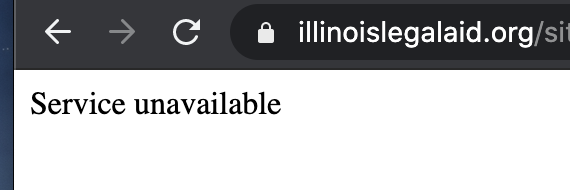

===================
Legal Content CMS
===================

Content types for legal content:

.. toctree::
   :maxdepth: 2
   :caption: Content types for legal content:
   
   cms_custom_tokens
   cms_legal_content
   cms_portal_main_page
   cms_toolboxes
   cms_adrm
   cms_content_reporting

Known Workarounds
===================

Redirect "Service unavailable"
--------------------------------
If you get a fast loading "service unavailable" message this is usually a redirect issue. (this is different than the "temporarily unavailable" message

To fix:

* Find the node that the url is supposed to be redirecting to
* In that node, there is probably a redirect that matches the path alias for that page (for example, for node 30691 has a path alias of https://www.illinoislegalaid.org/legal-information/divorce; if it has a redirect from https://www.illinoislegalaid.org/legal-information/divorce to https://www.illinoislegalaid.org/legal-information/divorce or to /node/30691 this will create an endless loog)
* Edit the redirect.  You will probably get a message that an infinte loop will be created
* Delete the redirect
* Test the original url that had the error; it should work now

Node form is outdated or modified by someone else
---------------------------------------------------
This bug happens when a staff or intern leaves content in draft or ready to review mode and then someone tried to edit that node, an error 

.. image:: ../assets/error-modified-by-another.png

To resolve:

* First, check that you don't have multiple edit windows open.  If you do, close them, and reload the edit form
* If it still persists, check that no one else has the page open for editing
* If that still doesn't resolve it, check that the current publish status is draft/revise or ready to review.  The only known workaround for this:

  * View the latest version 
  * That page has a drop down to change the state
  * Set the state to published
  * You should be able to edit and save the node now

.. note::  This is a known bug that we are working on getting fixed.

See also:

* `Content Team Documentation <https://sites.google.com/illinoislegalaid.org/contentnet/content-team-documentation>`_

