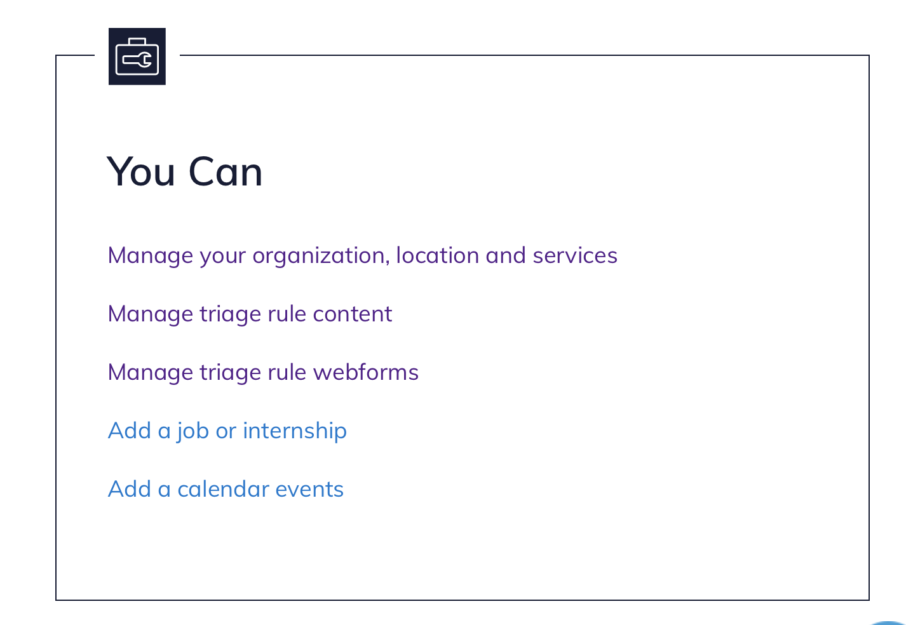
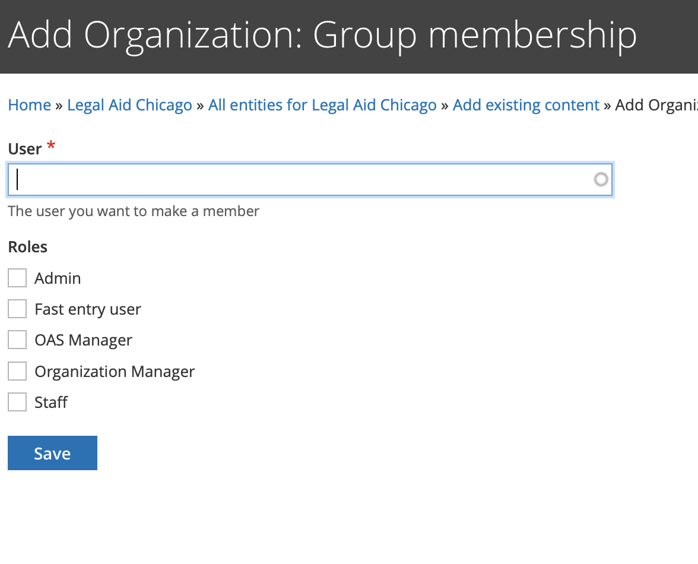
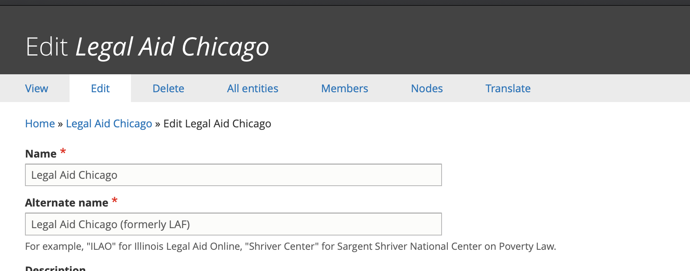
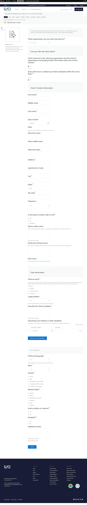

======================
Fast Entry Form
======================

The fast entry form can be used to quickly refer users to OTIS partners, bypassing all triage rules and the standard online intake forms.

Fast entry permissions
========================

The global fast entry form is accessible at /get-legal-help/fast-entry but is only accessible to:

* ILAO staff

The referral fast entry form is accessible at /get-legal-help/[organization]/fast-entry* but is only accessible to:

* ILAO staff
* Logged in website users who have been given the fast entry member role within the organization settings for the OTIS partner organization by an organization manager of the OTIS partner organization
* [organization] is replaced with the organization's specific name or acronym. Ex. Prairie State Legal Services, Inc. = /prairie-state

.. note:: OAS/OTIS managers should be given the Fast Entry role to be able to see the form.

Adding a fast entry user
--------------------------
An OTIS manager or organization manager will need to:

* Invite the fast entry user to register on IllinoisLegalAid.org if the user is not already registered;
* Once the user has registered, add the user to their organization (group membership); and
* Give the user the fast entry user role in their organization:

Click on Manage your organization, locations, and services from your dashboard

Go to All entities and select Add existing entity

.. image:: ../assets/otis-add-entity-main.png

and then click Group Membership

.. image:: ../assets/otis-add-existing-content.png

use the autocomplete to look up the user and give them the Fast entry user role by checking the box and clicking save:

To Remove the permission:
--------------------------

Go to Members

Select edit member next to the person you want to add (or remove) the fast entry role from:

.. image:: ../assets/otis-edit-member.png

Uncheck Fast entry user and save

.. image:: ../assets/otis-fast-entry-add.png

Related Intake Settings
==========================
Because fast entry bypasses triage rules and intake settings generally, ILAO staff will associate a single intake settings ID per organization in the Legal Server configuration.  This intake setting should be an intake that is generally left open. The legal issue taxonomy selected in the intake setting will not impact the law type options on the fast entry form. This id will then be used for data tracking. Fast entry intakes will not impact counts on any intake settings.

Related Triage Rule
======================
The fast entry form is built using a single webform and is attached to a separate triage rule per organization.

* The triage rule should be named "[ORG] Fast Entry";
* The service of the triage rule should match the service for the intake setting selected above;
* "Law practice" should be selected from the legal issue taxonomy to prevent any potential conflicts;
* [Organization] should be added as the Group audience;
* Attach the "Fast entry intake form" webform to the triage rule; and
* Assign a URL alias /get-legal-help/[organization]/fast-entry
* [organization] should be the organization's commonly known acronum or short name.

Fast entry form
====================

Confirmation
=================
Fast entry forms will be treated as "we call client" and a field for callback times is collected via a preferred day/time field.

.. image:: ../assets/fast-entry-confirm.png

Data capture & reporting
==========================

On submission, the form will create an etransfer into legal server. Because there is no triage the data will be slightly different than triage intake:

Oas Triage User Data Fields
------------------------------

* user_id should be the user ID of the person submitting the form
* created should be the time stamp the form is submitted
* changed should be the time stamp the form is submitted
* intake_created should be the time stamp the form is submitted
* intake_changed should be the time stamp the form is submitted
* zip_code should be the zip code entered in the address fields
* last_screen_viewed should be fast-entry
* county should be derived from zip_code
* state should be pulled from address fields
* triage_status should be Intake Available
* intake_status should be eTransferred
* intake_organization should be pulled from the intake_settings stored in the legal server configuration for the selected organization.
* lsc_code should be the name of the legal category term reference
* referral_source should be "Fast Entry"
* gender should be the gender name from the taxonomy
* race should be race name from the taxonomy
* marital_status should be should be the marital status name from the related taxonomy
* primary_language should be the language name from the related taxonomy
* etransfer_data should be the serialized etransfer packet

Other fields in ILAO's database
----------------------------------

* If the user entered a mobile phone, it should be stored in oas_triage_user__oas_mobile_phone
* Response to "Does client consent to receive confirmation and follow-up text messages from IllinoisLegalAid.org?* " should be stored in oas_triage_user__oas_opt_in_sms
* legal problem should be stored in oas_triage_user__oas_triage_search (check this) 
* current count SHOULD NOT BE changed in intake settings when the record is saved.

Etransferred elements only
------------------------------
These are sent to LegalServer only and not stored as fields in ILAO's website (except as webform submissions):

* Client first, middle, last name
* Client date of birth
* Client address, phone
* Alias first, middle, last name
* veteran (true or false)
* disabled (true or false)
* eTransferOrganization pulled from legal server configuration
* externalID should be ILAOWeb-[triage user id]
* email of user
* related phone notes and telephone (except for mobile numbers)

Notes only elements
----------------------

* Add "Source: Fast-entry from [email address of logged in user]"
* Does client consent to text messages from referral organization should be appended to notes as "Client consents to text messages: Yes" or Client consents to text messages: No"
* Adverse party should be appended to notes as "Adverse party: [names]"
* Describe the client's problem as entered with a prefix of "Problem description: "
* Upcoming dates/deadlines should be appended to notes formatted as "Upcoming court dates and deadlines: [date (description); date(description)]"
* Additional notes as entered with a prefix of "Additional notes:" 

Not stored elements
---------------------

This data is not stored anywhere except in webform submissions

* Yes/no for client consents
* Yes/no for related court date

If either of these are no, there should be no data saved at all and no eTransfer created.

