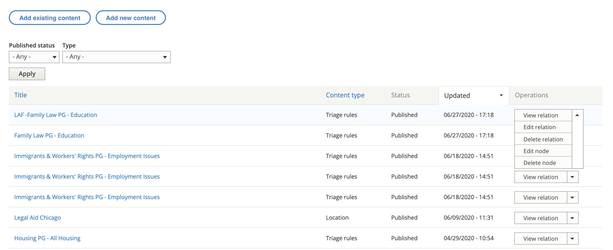

=======================================
Locations & Services
=======================================

.. toctree::
   :maxdepth: 1
   :caption: Contents:

   otis_organization_locations
   otis_organization_services

   
Organization managers can manage the organization's locations and services (and triage rules) from the organization's nodes page when editing their organization profile.

This report can be filtered by whether the item is published or not and the content type.  Only 3 content types above are owned by organizations but all of the website content types are listed in the drop down. Those three types are:

* locations
* services
* triage rules

Add existing versus add new content
====================================

In almost all cases, organization managers will add new content.  Adding existing content should only be used if the location, service or triage rules was created by ILAO staff who and not properly associated with the organization.

