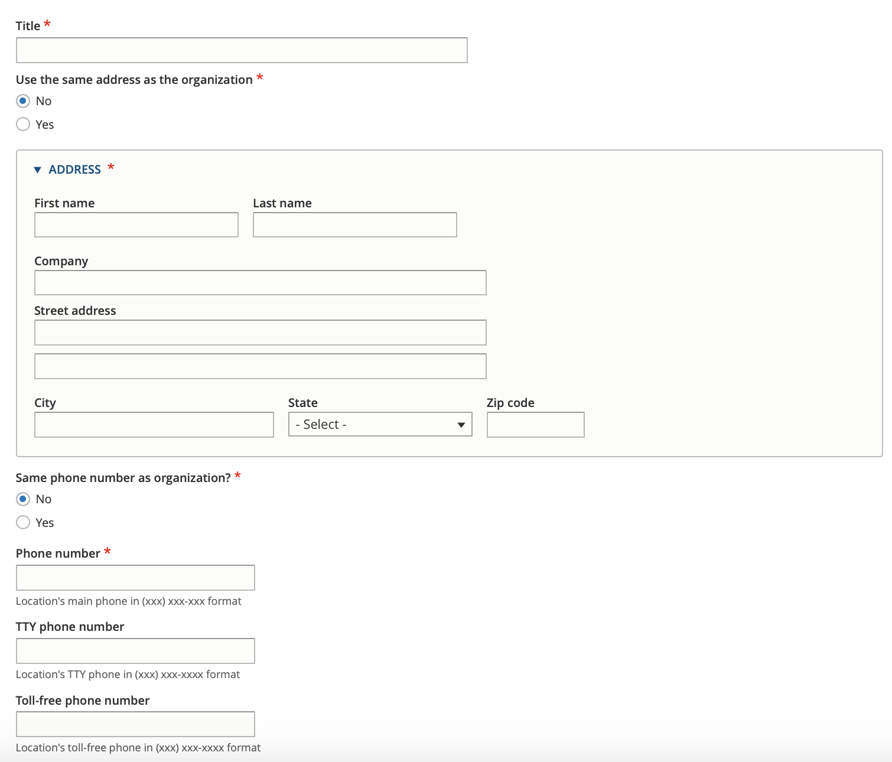
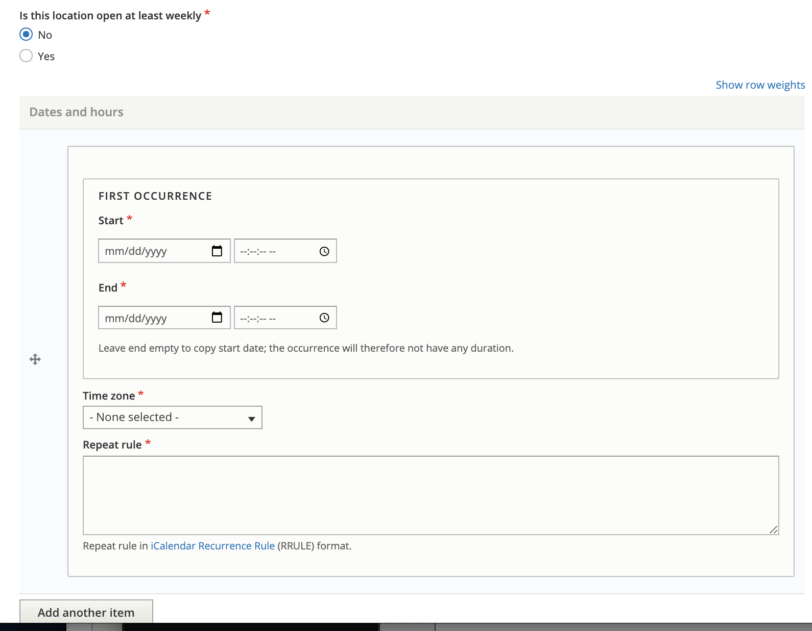
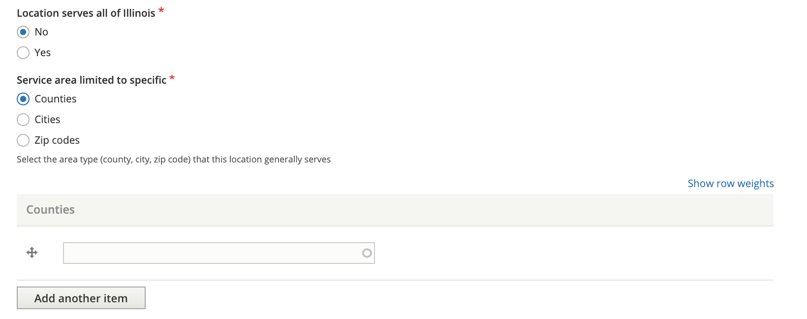
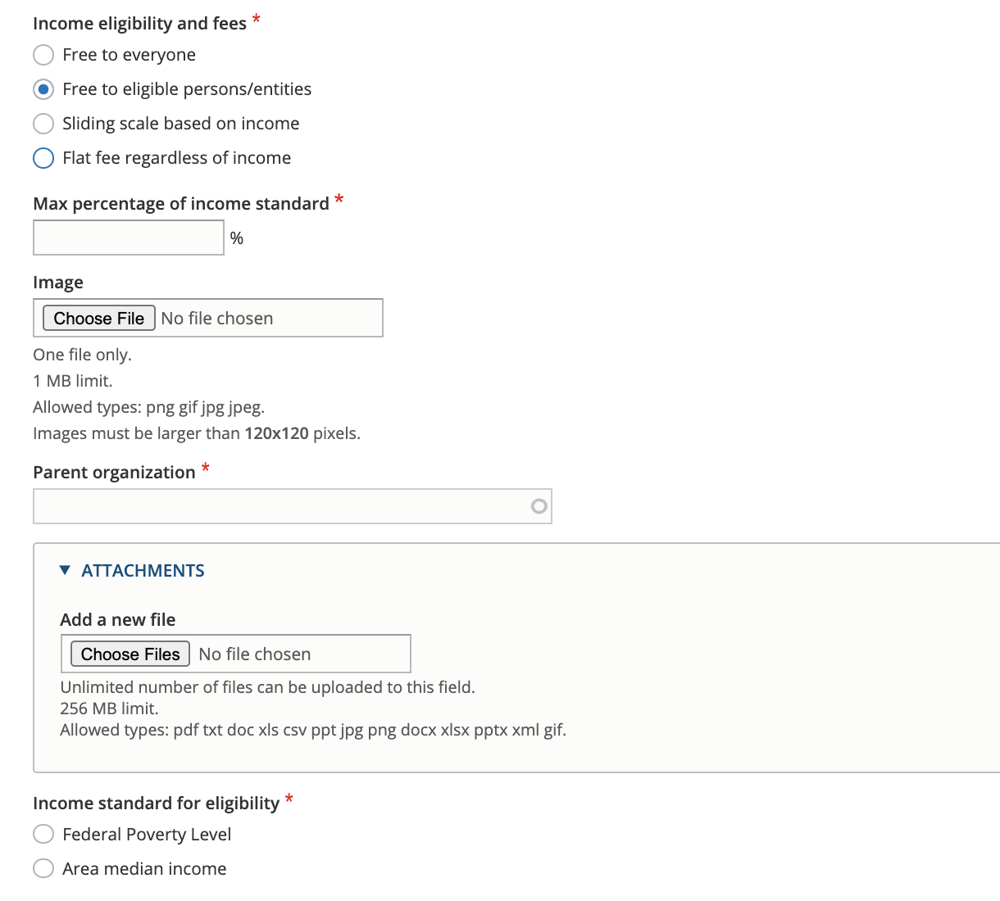
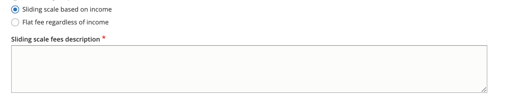

=======================
Managing Locations
=======================

Organizations have locations, which have services.  

ILAO staff, organization managers, and OTIS managers can all add or edit locations.  

The add/edit location form is the same for both ILAO staff and organization/OTIS managers.

Title
========
Every location requires a title, or name.  The name should be descriptive enough that when displayed to users it makes sense.  For example:  Bond County Courthouse, Main Office, Waukegan Office.  

Address
==========
Every location requires an address.  By checking "Yes" to the "Same address as the organization" will copy the physical address of the organization to the location.

Phone numbers
================
Every location requires a phone number.  By checking "Yes" to "Same phone number as organization," the phone number from the organization will be copied.

In addition, additional phone numbers for TTY and Toll-free numbers are optional.

Phone numbers should be formatted as (xxx) xxx-xxxx.

Hours of Operations
=======================
There are two options to set a location's hours of operations: regular weekly hours and less frequent hours.  These may be overwritten at the service level.

When a location is open at least 1 day every week, the "Is this location open at least weekly?" should be set to Yes.

The weekly hours form allows one to:

* Set individual hours per day
* Set up to 4 time slots per day; for example:  Monday 8 am - 12pm, 1pm - 5pm

.. image:: ../assets/otis-locations-hours-regular.png

When a location is not open at least once a week, then we have to use the irregular hours form.  This form requires:

* setting a start date for the rule
* setting an end date for the rule
* setting a rule.  The rule can be generated `using this online tool <https://icalendar.org/rrule-tool.html>`_ and then copied and pasted in.

Holidays
==========
Holidays should be set for the location and may be overwritten at the service level.  

.. image:  ../assets/otis-locations-holidays.png

Holidays are managed in the `holidays taxonomy <https://www.illinoislegalaid.org/admin/structure/taxonomy/manage/holidays/overview>`_.  Common Illinois and Federal holidays are included in the taxonomy.

.. note:: Custom holidays can be added to the holiday taxonomy to accommodate unusual events where one or more organizations needs to be closed (such as a staff retreat) or for unusual occurrences (such as the every 4-5 years when the day after Thanksgiving is not the 4th Friday).  

Service area
===============
The service area consists of at least one question: does the location serve all of Illinois? If the location is less than statewide, then the user is required to set the service area at the county, city, or zip code level.  

For example, a location that serves Kane, Kendall, and DeKalb counties would have the limit to specific area set to Counties and then would list the 3 counties.  If a location serves only part of a county (for example, just the city of Chicago in Cook county, the limit to specific area should be set to Cities and Chicago should be listed).

.. note:: The service area can be overridden at the service level.  For example, a location may serve 3 counties but have a specialty service that only serves 1 county.

Income eligibility & fees
============================
Every location should indicate what it typically charges users/clients.  There are 4 options:

* Free to everyone.  This should be used when there is generally no charge and everyone is eligible.
* Free to eligible persons/entities.  This should be used when the location generally has income limits.  For example, the location only serves clients with income less than 125% of the federal poverty level.
* Sliding scale based on income.  
* Flat fee regardless of income

When free to eligible persons/entities is selected, the user is then required to set an income limit and apply an income standard.  

When the user selects sliding scale or flat fee, a description of those fees is required.

.. note:: These settings can be overwritten at the service level and services can be further restricted to specific populations for the free to eligible persons/entities.

Additional Fields
=====================

There are a handful of additional fields for locations that are not currently displayed to users:

* Volunteer information
* Image
* Attachments.

.. todo:: The volunteer information is no longer used and should be deprecated.

Parent Organization
=====================
This needs to be set to the organization the location belongs to.  "Same as" fields will not copy correctly without this being set.
