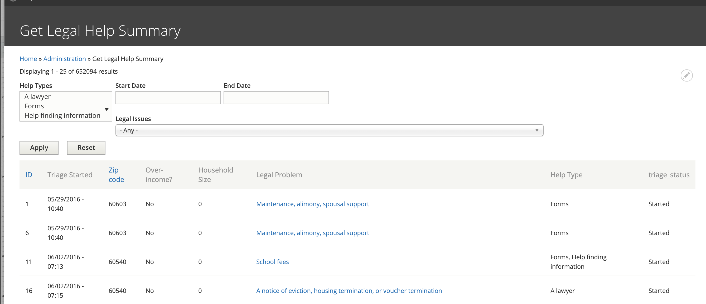

==============================
Get Legal Help Summary Report
==============================

The `Get Legal Help summary report <https://www.illinoislegalaid.org/admin/intake/reporting/get-legal-help-summary>`_ provides an overview of Get Legal Help usage.

Report Data
=============
The report includes:
* unique ID of the triage user.  Every user who fills out the Get Legal Help page form is assigned a unique ID.  if a user completes the form multiple times, each instance gets a new ID.  
* The date/time the triage was started.
* The provided zip code
* Whether the user answered Yes or No to the income question.  This question is only captured when they are seeking a lawyer.
* Their household size.  This is only captured when they are seeking a lawyer.
* Help type the user is seeking: information, forms, and/or lawyers
* Triage status

Filters
==========
Data can be directly filtered by:

* One or more help types
* Start and end dates of when the triage form was started
* Legal issues.  
* Additional filtering may be done by exporting to CSV and working with the data directly.

.. todo:: A review of the legal issues filter needs to be done to ensure that it is returning nested results even when the value is set further into triage.

Triage statuses
================

