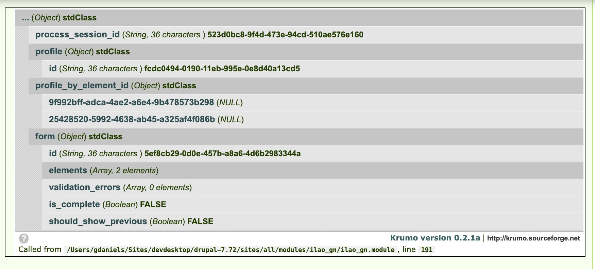
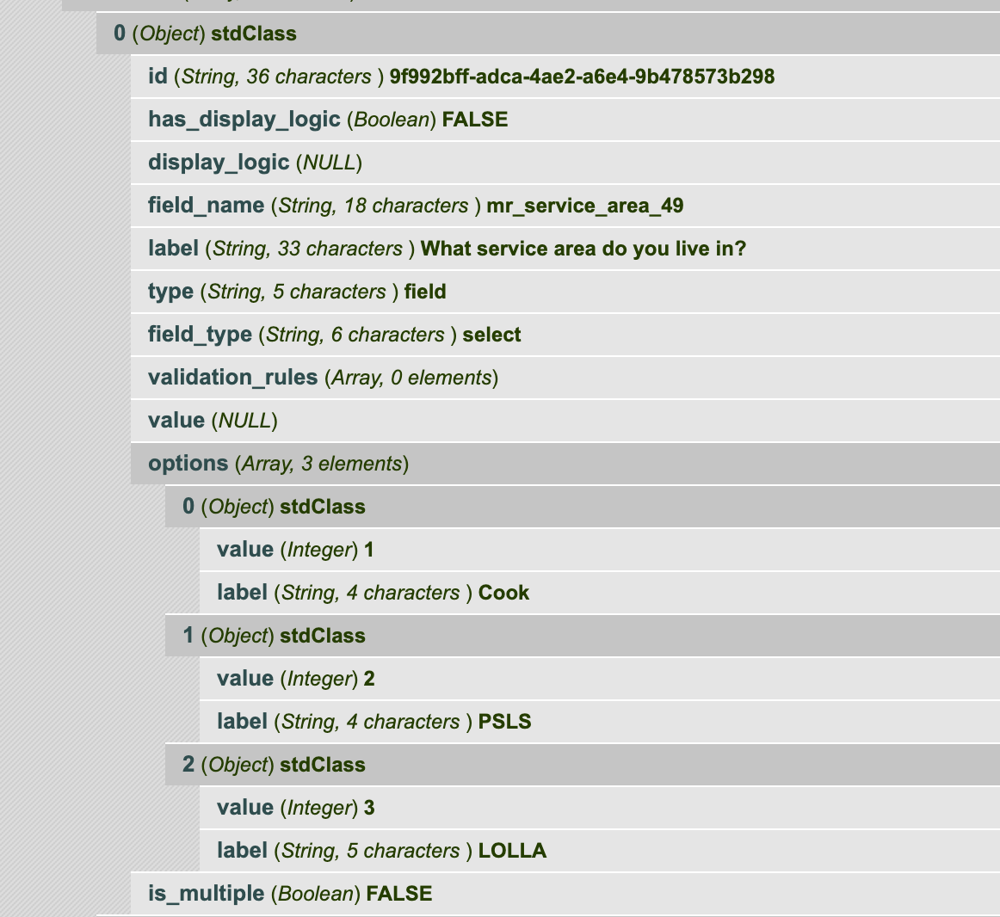
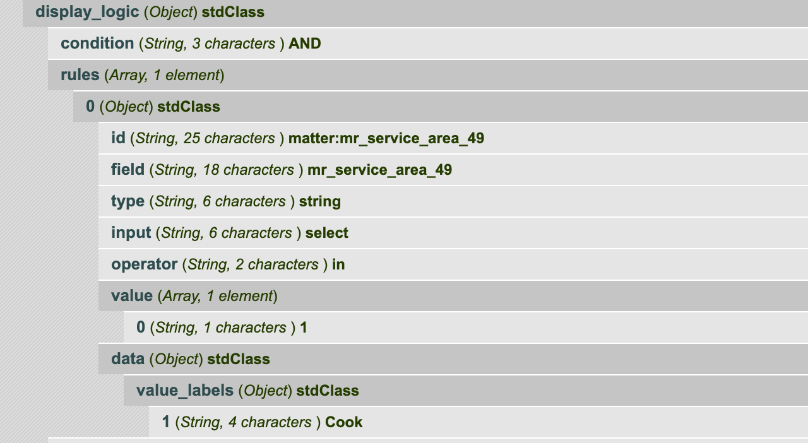

==============================
Guided Navigation API Docs
==============================

Stored variables
==================
ILAO stores in Drupal configuration:

* API Server location (https://[sitename].legalserver.org/api/v1/processes for example)
* Username authorized to use API
* Password associated with the username

API Invocations
===================

Get list of processes
------------------------
This code snippet returns the list of processes available to Guided navigation

.. code-block:: php

    $gn = ilao_gn_load_keys();
    $url = $gn['server'];
    $ch = curl_init();
    curl_setopt($ch, CURLOPT_URL, $url);
    curl_setopt($ch, CURLOPT_RETURNTRANSFER, 1);
    curl_setopt($ch, CURLOPT_HTTPAUTH, CURLAUTH_BASIC);
    curl_setopt($ch, CURLOPT_USERPWD, $gn['user'] . ':' . $gn['pass']);
    $result = curl_exec($ch);
    $processes = json_decode($result);
    return $processes;
    
The resulting json contains an array of objects.  The objects contain:

* id.  This id is used throughout the system to identify which guided navigation process is involved in a transaction.
* name. The name in LegalServer of the process
* type.  The type of process

When decoded, in Drupal this results in an array of objects as follows:

.. image:: ../assets/otis-gn-processes.png     
    
Start a new session for a specific Guided Navigation process
---------------------------------------------------------------

.. code-block:: php

    $gn = ilao_gn_load_keys();
    $url = $gn['server'] . '/' . $intake_id . '/sessions';
    $ch = curl_init();
    curl_setopt($ch, CURLOPT_URL, $url);
    curl_setopt($ch, CURLOPT_CONNECTTIMEOUT, 20);
    curl_setopt($ch, CURLOPT_CUSTOMREQUEST, "POST");
    curl_setopt($ch, CURLOPT_POST, true);
    //  curl_setopt($ch, CURLOPT_POSTFIELDS, $data_string);
    curl_setopt($ch, CURLOPT_RETURNTRANSFER, true);
    curl_setopt($ch, CURLOPT_USERPWD, $gn['user'] . ':' . $gn['pass']);
    curl_setopt($ch, CURLOPT_SSL_VERIFYPEER, false);
    curl_setopt($ch, CURLOPT_HTTPAUTH, CURLAUTH_BASIC);
    curl_setopt($ch, CURLOPT_HTTPHEADER, array(
            'Accept: application/json',
            'Content-Type: application/json')
    );
    $result = curl_exec($ch);
    $start = json_decode($result);
    return $start;

.. note:: in the above example, $intake_id represents the process ID from the list of processes.   

.. code-block:: json

   {"process_session_id":"523d0bc8-9f4d-473e-94cd-510ae576e160",
   "profile":{"id":"fcdc0494-0190-11eb-995e-0e8d40a13cd5"},
   "profile_by_element_id":{"9f992bff-adca-4ae2-a6e4-9b478573b298":null,
   "25428520-5992-4638-ab45-a325af4f086b":null},
   "form":{"id":"5ef8cb29-0d0e-457b-a8a6-4d6b2983344a",
   "elements":[{"id":"9f992bff-adca-4ae2-a6e4-9b478573b298",
   "has_display_logic":false,
   "display_logic":null,
   "field_name":"mr_service_area_49",
   "label":"What service area do you live in?",
   "type":"field",
   "field_type":"select",
   "validation_rules":[],
   "value":null,
   "options":[{"value":1,
   "label":"Cook"},
   {"value":2,
     "label":"PSLS"},
   {"value":3,
     "label":"LOLLA"}],
   "is_multiple":false},
   {"id":"25428520-5992-4638-ab45-a325af4f086b",
     "has_display_logic":false,
     "display_logic":null,
     "field_name":"mr_ilao_legal_issue_58",
     "label":"Please describe your legal issue",
     "type":"field",
     "field_type":"text",
     "validation_rules":[],
     "value":""}],
     "validation_errors":[],
     "is_complete":false,
     "should_show_previous":false}}

The resulting JSON when decoded into a Drupal format results in

* a process_session_id (string).  This is used for the entire user's session
* a profile (object).  This is updated over time as new data is gathered
* a profile_by_element_id (object). 
* a form object.  This contains all the information about the form to display.

Submit data to Guided Navigation
-----------------------------------

.. code-block:: php

    $gn = ilao_gn_load_keys();
    $url = $gn['server'] . '/' . $intake_id . '/sessions/' . $process_id . '/forms/' . $gn_form_id;
    $data = json_encode($data);
    $ch = curl_init();
    curl_setopt($ch, CURLOPT_URL, $url);
    curl_setopt($ch, CURLOPT_CONNECTTIMEOUT, 20);
    curl_setopt($ch, CURLOPT_CUSTOMREQUEST, "PUT");
    curl_setopt($ch, CURLOPT_POSTFIELDS, $data);
    curl_setopt($ch, CURLOPT_RETURNTRANSFER, true);
    curl_setopt($ch, CURLOPT_USERPWD, $gn['user'] . ':' . $gn['pass']);
    curl_setopt($ch, CURLOPT_SSL_VERIFYPEER, false);
    curl_setopt($ch, CURLOPT_HTTPAUTH, CURLAUTH_BASIC);
    curl_setopt($ch, CURLOPT_HTTPHEADER, array(
            'Accept: application/json',
            'Content-Type: application/json')
    );
    $result = curl_exec($ch);

    $response = json_decode($result);

.. note:: 

   In the above, it expects 4 variables to be available:
   
   * intake_id which is the guided navigation process id
   * process id which is the specific process session id
   * gn_form_id which is the specific form id
   * data, which is an array of field ID and value.
   
      
Understanding the Guided Navigation form object
==================================================

Each form has:

* a unique ID associated with it that appears to change with each invocation.  
* a set of elements that define the form
* an array of validation errors
* a boolean of is_complete.  When is_complete is TRUE, we've reached the end of the dialogue.
* a boolean of should_show_previous.  When TRUE, we can allow the user to go back a form page.

Elements
=============

The heart of the form is the elements.

Every (form) element has:

* a unique id
* a boolean to indicate whether there display logic.
* display_logic, which has data when has_display_logic is TRUE.
* a type.  Known supported types are field, headline

Fields
----------
Known supported field types are select, text, bool,

Form fields will have:
* a field_type which indicates the type of field 
* a value field
* validation_rules as an array, when the field has validation rules.
* a value.  This may be pre-filled with a default value from Guided Navigation.

Select
^^^^^^^^^^
A select field will have:

* a field_type of select
* an array of options.  Each option is an object with a value and a label.  The label is shown to the user while the value is stored and shared back to Guided Navigation.
* a boolean of is_multiple.  When this is true, the field is a multiselect and/or checkboxes.  When the value is false, the field is a single select or radio buttons.
* a value.  This may be pre-filled with a default value from Guided Navigation.

Text
^^^^^^^
* a field_type of text

Bool
^^^^^^
* a field_type of bool
* no options; these should be Yes, No with values of t and f

Non-field Elements
---------------------

Instructions
^^^^^^^^^^^^^^^

Headline
^^^^^^^^^
A headline is just HTMl-formatted text. A headline will have:

* a type of headline
* an html_value 

Display logic
---------------------

When the element's has_display_logic is true, the display_logic property will have data.

The display_logic property will be an object with:
* a condition property. Expected values are AND, OR. When there are multiple rules, this condition sits between them
* a rules property.  This is an array of rules to test for
* a not boolean.  When this is true, the rules should be tested as NOT. 
* a valid boolean.  It is unclear what the purpose of this is.

Rules
^^^^^^^^
Rules is an array that contains the conditions to test against.  Each element in the array contains an object with:

* an id
* field, which represents the field to test against.  This can be found in the profile from Guided Navigation for a particular session
* type (known types: string)
* input
* operator.  Known types are contains, not_contains, equal, not_equal, begins_with, in, is_empty, is_not_empty,
* value.  This is either a string (for contains, not contains) or an array of values (for in operators)
* data.  For in operators, this is the data to test against.

In the above, the element would display if the field mr_service_area_49 had a value IN (1)

.. image:: ../assets/otis-gn-display-logic-complex.png

In the above, the element would display if the mr_ilao_legal_issue_58 had a value that contains 'end' OR'shut_off' OR 'no longer getting' OR 'shutoff'

Validation Rules
------------------

Validation rules for an element, if not empty, is an array of rules.  Each element is an object with a proprety of type.  A type of required is the most common and indicates that a form element should be required.

