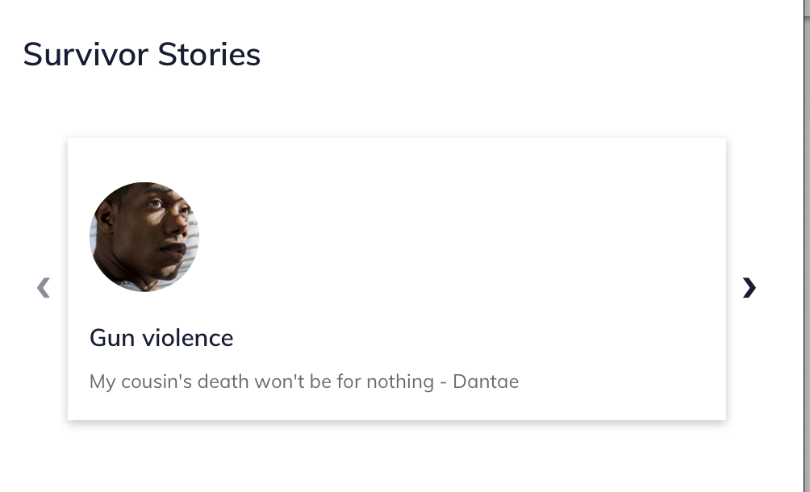

======================
Portal layout grid
======================

The portal layout grid is used to showcase snippets of information that lead to underlying portal pages.  Example uses:

* Survivor stories or user personas (see the Victims of Crime portal)
* Toolboxes, tools, or other content (see the Ready to Work portal)

A grid layout contains:

* A title
* A portal grid columns with one or more portal stories; ideally there should be at least 3 portal stories if using the grid component. 

.. image:: ../assets/portal-story.png

A portal story includes:

* A title
* An image
* A quote
* A summary (to be removed in a future release)
* A button url and link text

.. note::  The summary no longer displays; the button text also does not display as the entire grid card is the link.

Examples
===========

.. image:: ../assets/portal-grid-desktop.png

Placement
==============
Grids are always placed in the left column (desktop) and beneath any sidebar items on mobile.

Grids are rendered in the order they are placed in the main column, except that timelines always render last.

Portal stories within a grid are rendered in the order in which they are placed.

