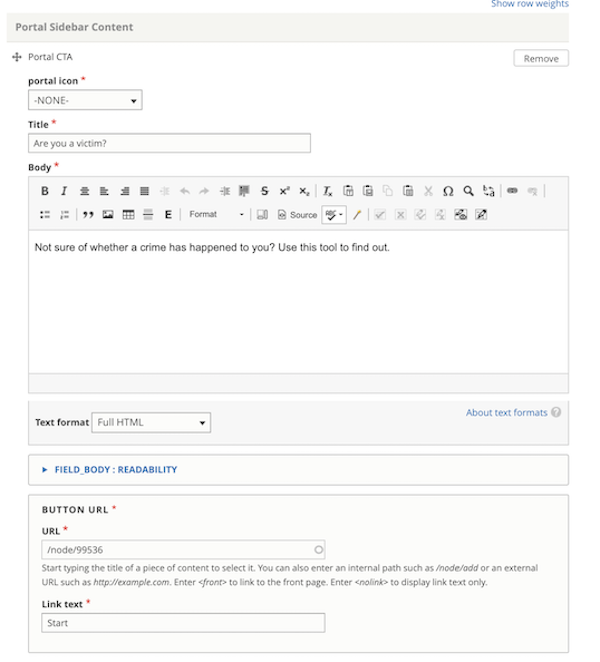
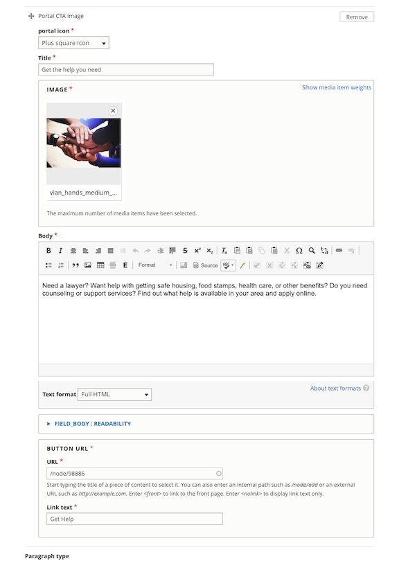
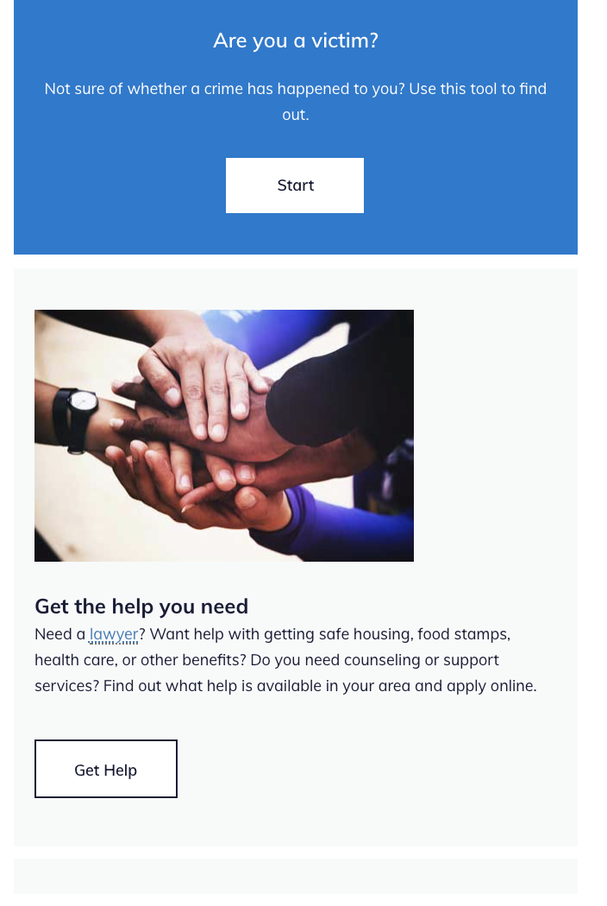

============================
Portal layout sidebar
============================

A portal layout sidebar is designed to provide call-to-action components outside of the main content.  It can contain two types of components:

* Portal CTA
* Portal CTA image

Portal CTA
============
The portal CTA has fields for:

* portal icon (to be deprecated; is not displayed to users)
* Title 
* Body
* Button label and url

All are required.

What users see
----------------
The Portal CTA is always rendered with the ILAO CTA blue background with white text and the solid white button.

Portal CTA image
===================

The portal image CTA has fields for:

* portal icon (to be deprecated; is not displayed to users)
* image
* Title 
* Body
* Button label and url

All fields are required.

What users see
---------------
The Portal image cta is always rendered with a light gray background, text in the ILAO body color with a white button with a blue border.

Examples
==========

The above example contains a Portal CTA item and a Portal CTA image item.

Placement
===========

The portal layout sidebar appears on the right on desktop and above the main content section on mobile.
