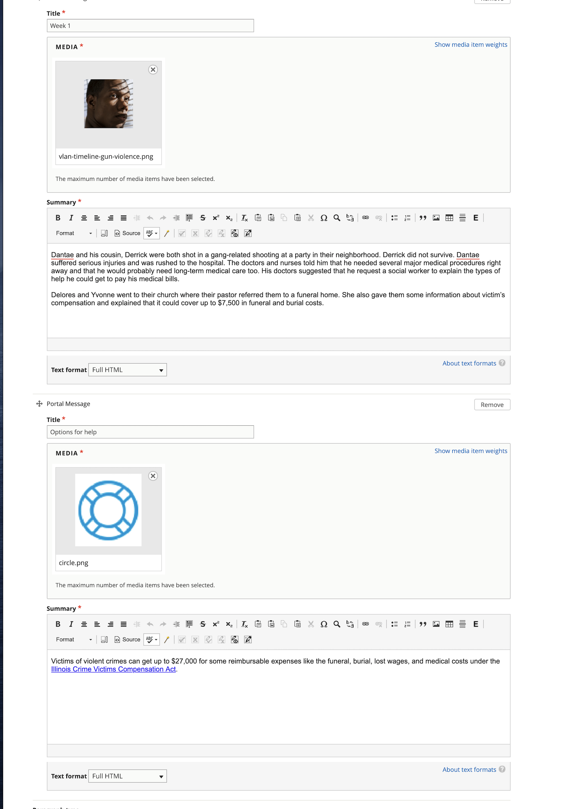

===========================
Portal layout timeline
===========================

The portal layout timeline is used to render a linear timeline.  It does not support branching.

A timeline element includes:

* A portal tab.  This is rendered as a text label with a background color.
* A timeline box which consists of:

  * A title
  * An image 
  * A summary
  * An optional 2nd portal message which includes:
  
    * A title
    * An image (this is required but not rendered)
    * A summary
    

 
What users see
==================  

On mobile, the timeline elements render on a timeline with the image next to the title with the tab title next to the title and the summary beneath the image/title/tab.  For elements that have a second portal message, the image is replaced with the blue circle.
  
.. image:: ../assets/portal-timeline-mobile.png
   :scale: 50%

On desktop, the timeline elements render full-width of the page, with with the image next to the title with the tab title next to the title and the summary in a card next to the image/title/tab..  For elements that have a second portal message, the image is replaced with the ILAO logo.
  

.. image:: ../assets/portal-timeline-desktop.png

Placement
=============

Because timelines are full-width, they are always rendered beneath any other portal layouts.  Individual timeline boxes are rendered in the order they are listed.