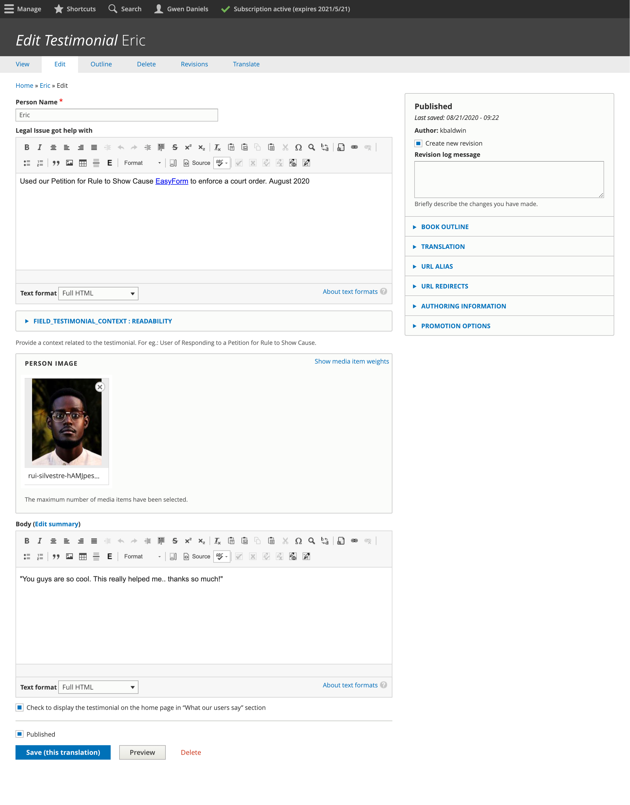
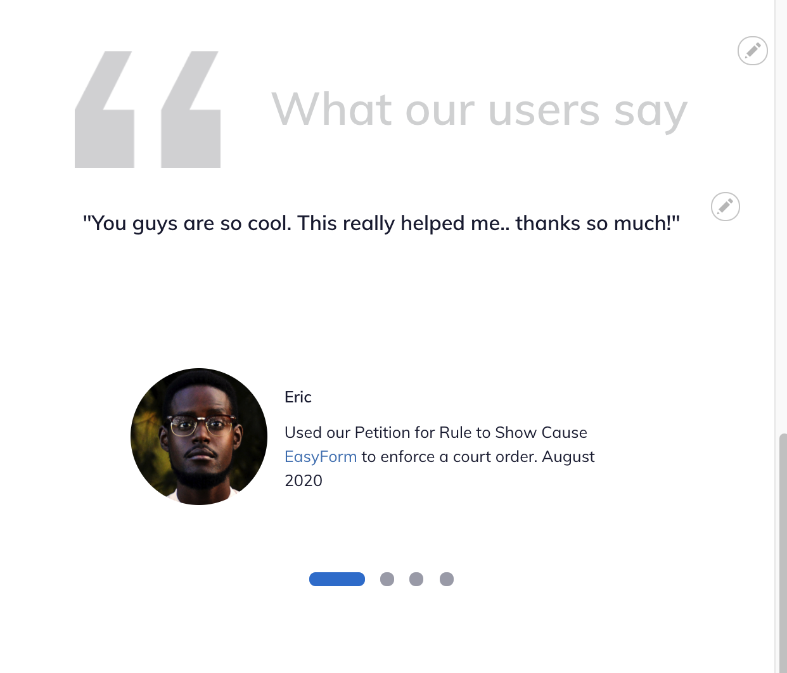
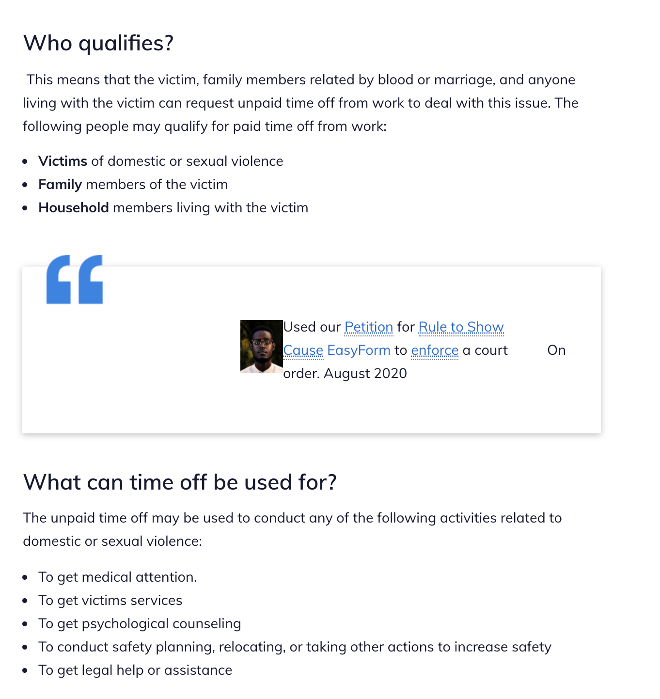

==========================
Testimonials Content Type
==========================

The testimonials content type is used:

* to store positive stories that can be highlighted on the home page and (eventually) within content.

.. todo:: Add fields that will make it easier to track and use:  date of feedback as a field, legal issue(s), feedback source.  Update the embed button to limit use to testimonials and to teaser view.

When rendered on the home page:

When embedded within legal content:

Mobile:

.. image:: ../assets/testimonial-final.png